# Cours Git - 11h (TD)

## Sommaire

- [Introduction (1h30)](#introduction-1h30)
- [Bases fondamentales (3h)](#bases-fondamentales-3h)
- [Branches et workflow (3h)](#branches-et-workflow-3h)
- [Travail en équipe et remotes (1h30)](#travail-en-équipe-et-remotes-1h30)
- [TP avancé (1h)](#tp-avancé-1h)
- [QCM final (1h)](#qcm-final-1h)

---

## Introduction (1h30)

### 🎯 Objectifs pédagogiques

- Comprendre le versioning et ses enjeux.
- Identifier la différence entre systèmes centralisés et décentralisés.
- Installer Git et configurer son identité.
- Définir les concepts fondamentaux de Git.

### Qu'est-ce que le versioning ?

Le versioning (gestion de versions) permet de suivre l'évolution d'un projet dans le temps, de revenir en arrière, et de travailler à plusieurs sans écraser le travail des autres.

:::danger
**Concrètement** : imaginez que vous travaillez à 5 sur un site web. Sans versioning :
- Vous vous envoyez des fichiers par email → qui a la dernière version ?
- Vous écrasez le travail des autres → comment récupérer ce qui a été perdu ?
- Pas de retour en arrière → une erreur et c'est la catastrophe.
:::

### Pourquoi Git ?

- **Distribué** : chaque développeur possède l'historique complet.
- **Rapide** : opérations locales instantanées (log, diff, commit).
- **Robuste** : historique vérifiable, branchements efficaces.
- **Standard industriel** : GitHub, GitLab, Bitbucket.

### Systèmes centralisés vs décentralisés

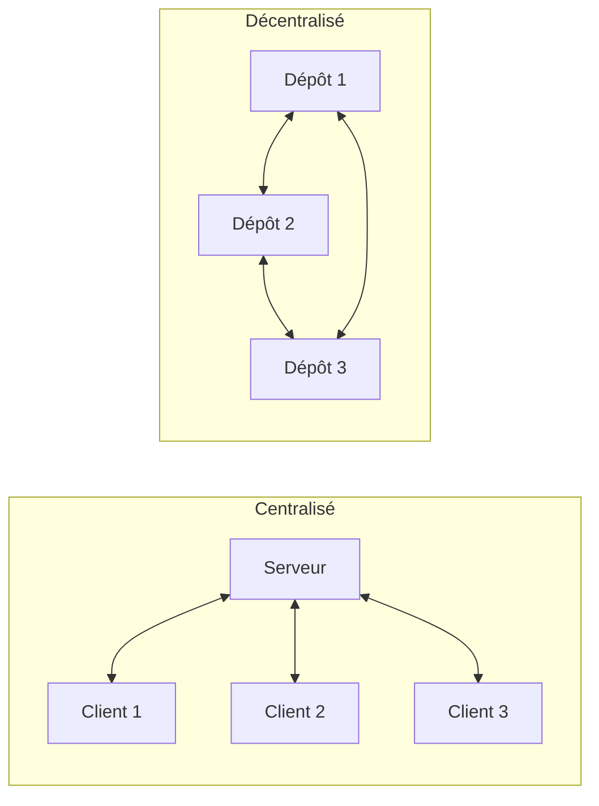

| Type | Exemple | Avantage principal | Limite principale |
|------|---------|-------------------|-------------------|
| Centralisé | SVN, CVS | Simple à administrer | Dépend d'un serveur unique, pas de travail offline |
| Décentralisé | Git, Mercurial | Autonome, copie complète locale, travail offline | Gestion des binaires moins optimale |

**Avantages du décentralisé (pro)** :
- Ne dépend pas d'un serveur
- Travail sans connexion
- Chaque machine contient l'historique complet
- Possibilité de définir un dépôt de référence (GitHub, GitLab)

### À propos de Git

- Première version : 7 avril 2005
- Créé par **Linus Torvalds** (auteur du noyau Linux)
- Licence : GNU GPL v2
- Écrit en C, Shell, Perl, Tcl, Python, C++
- Dernière version stable : 2.53.0 (février 2026)

### Installation et configuration

#### Installer Git

- **Windows** : https://git-scm.com/downloads ou `winget install --id Git.Git -e`
- **macOS** : `brew install git` ou Xcode Command Line Tools
- **Linux** : `sudo apt-get install git-all` (Debian/Ubuntu)

#### Configuration de base

:::important
La configuration de `user.name` et `user.email` est **obligatoire** pour être identifié dans vos commits. Sans cela, Git refusera de créer des commits.
:::

```bash
# Vérifier la version
git --version

# Configuration globale (obligatoire pour être identifié)
git config --global user.name "Prénom Nom"
git config --global user.email "prenom.nom@email.com"

# Vérifier
git config --global --list
```

**Configuration recommandée** :

```bash
# Nom de branche principale par défaut
git config --global init.defaultBranch main
```

### Configuration avancée

:::note
Git propose 3 niveaux de configuration (du plus large au plus spécifique) :
- `--system` : pour tous les utilisateurs du système
- `--global` : pour votre utilisateur sur toutes les machines
- `--local` : pour le dépôt courant uniquement
:::

#### Globale vs Locale

```bash
# Config globale (tous les dépôts)
git config --global user.name "Prénom Nom"
git config --global user.email "email@exemple.com"

# Config locale (dépôt courant uniquement)
git config --local user.name "Prénom Nom"  # Surcharge la globale
git config --local user.email "email@projet.com"

# Voir la config avec ses niveaux
git config --list --show-origin
```

:::tip
Utilisez `--local` pour :
- Un projet professionnel avec un email différent
- Tester des configurations sans impacter vos autres projets
:::

#### Créer des alias

Les alias permettent de créer des raccourcis pour les commandes fréquentes.

```bash
# Raccourcis pratiques
git config --global alias.st "status"           # git st
git config --global alias.co "checkout"         # git co
git config --global alias.br "branch"            # git br
git config --global alias.ci "commit"            # git ci

# Alias avancés
git config --global alias.last "log -1 HEAD"                    # Dernier commit
git config --global alias.graph "log --oneline --graph --all"   # Vue graphique
git config --global alias.undo "reset --soft HEAD~1"            # Annuler dernier commit
git config --global alias.a "add"                               # git a
git config --global alias.aa "add --all"                       # Tout ajouter

# Alias pour les branches
git config --global alias.co-main "checkout main"
git config --global alias.co-develop "checkout develop"
```

#### Personnaliser les couleurs

```bash
# Activer les couleurs
git config --global color.ui auto

# Couleurs spécifiques
git config --global color.branch.current "yellow reverse"
git config --global color.branch.local "yellow"
git config --global color.branch.remote "green"
git config --global color.diff.meta "yellow bold"
git config --global color.diff.frag "magenta bold"
git config --global color.status.added "green"
git config --global color.status.changed "yellow"
git config --global color.status.untracked "red"
```

#### Mode de commit (editor)

```bash
# Changer l'éditeur par défaut
git config --global core.editor "code --wait"      # VS Code
git config --global core.editor "nano"              # Nano
git config --global core.editor "vim"               # Vim
git config --global core.editor "subl -n -w"        # Sublime Text

# Utiliser un merge tool
git config --global merge.tool "vimdiff"
git config --global merge.tool "code --wait"

# Définir le pager
git config --global core.pager ""        # Désactiver le pager
git config --global core.pager "less -R" # Activer avec couleurs
```

#### Configuration pour la pratique

```bash
# Configuration complète recommandée
git config --global init.defaultBranch main
git config --global user.name "Prénom Nom"
git config --global user.email "prenom.nom@email.com"
git config --global color.ui auto
git config --global alias.last "log -1 HEAD"
git config --global alias.graph "log --oneline --graph --all"
git config --global alias.st "status"
```

#### Vérifier sa configuration

```bash
# Voir toute la config
git config --global --list

# Voir une valeur précise
git config --global user.name

# Éditer la config directement
git config --global --edit
```

### Concepts fondamentaux

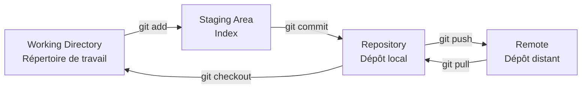

| Concept | Définition |
|---------|------------|
| **Repository** | Espace contenant l'historique complet du projet (.git/) |
| **Working Directory** | Dossier visible où vous modifiez les fichiers |
| **Staging Area (Index)** | Zone tampon pour sélectionner ce qui sera commité |
| **Commit** | Instantané versionné avec message descriptif |
| **HEAD** | Pointeur vers le commit/branche courante |
| **Remote** | Dépôt distant (GitHub, GitLab, Bitbucket) |
| **Branch** | Ligne de développement parallèle |
| **Tag** | Marqueurs immuables sur un commit (versions) |

### États d'un fichier

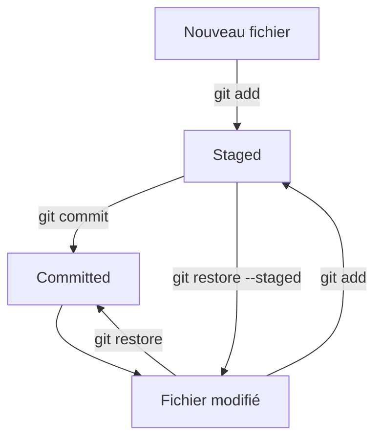

- **Untracked** : nouveau fichier, non suivi par Git
- **Modified** : fichier suivi, modifié mais pas en staging
- **Staged** : modification ajoutée à l'index, prête pour le commit
- **Committed** : enregistré dans l'historique

:::tip
Utilisez fréquemment `git status` pour voir dans quel état se trouvent vos fichiers !
:::

### Mini TD 0 : vérification d'installation (20 min)

1. Vérifier que Git est installé : `git --version`
2. Afficher l'aide générale : `git help`
3. Configurer votre identité en global
4. Vérifier la configuration avec `git config --global --list`
5. Expliquer la différence entre config globale et locale

### Questions d'entraînement (10 min)

1. Pourquoi un dépôt Git est-il utile pour travailler à plusieurs ?
2. Quelle commande permet de voir toutes les commandes Git disponibles ?
3. Où se stocke l'historique Git localement ?
4. Pourquoi renseigner `user.name` et `user.email` ?
5. Citer un avantage et un inconvénients des systèmes centralisés.
6. Pourquoi dit-on que Git est un système décentralisé ?

### ✅ Ce que l'étudiant doit savoir faire

- Expliquer le rôle du versioning.
- Distinguer centralisé et décentralisé.
- Installer Git et configurer son identité.
- Définir repository, working directory, staging area, commit et HEAD.
- Vérifier une installation Git et une configuration correcte.
- Expliquer la différence entre dépôt local et distant.
- Identifier les états d'un fichier (untracked, modified, staged).

---

## Bases fondamentales (3h)

### 🎯 Objectifs pédagogiques

- Créer un dépôt local et enregistrer des changements.
- Comprendre l'état des fichiers et l'historique.
- Utiliser les commandes de base en autonomie.

### Commandes essentielles

```bash
git init      # Crée un dépôt
git add       # Ajoute au staging
git commit    # Enregistre les changements
git status    # Affiche l'état
git log       # Affiche l'historique
git diff      # Affiche les différences
```

### Anatomie d'un commit

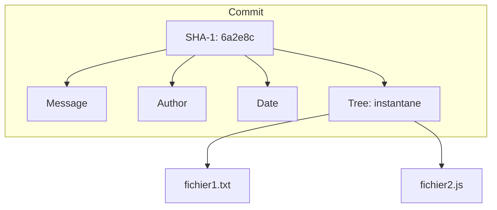

Chaque commit contient :
- **SHA-1** : identifiant unique (40 caractères, 7 suffisent souvent)
- **Auteur** : nom et email
- **Date** : horodatage
- **Message** : description du changement
- **Tree** : instantané des fichiers

### Mini TD 1 : créer son premier dépôt (20 min)

Objectif : initialiser un dépôt et faire un commit propre.

```bash
mkdir demo-git
cd demo-git
git init
```

Questions :
1. Quel dossier apparaît après `git init` ?
2. Que contient ce dossier `.git` ?

### Mini TD 2 : add et commit (30 min)

```bash
echo "# Mon Projet" > README.md
git status

git add README.md
git status

git commit -m "init: add README"
git log --oneline
```

**Points à observer** :

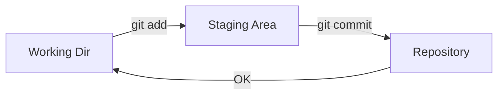

- Avant `git add` : fichier **untracked** (non suivi)
- Après `git add` : fichier **staged** (dans l'index)
- Après `git commit` : fichier **committed** (versionné)

Questions :
1. Quelle commande montre l'état du staging ?
2. Pourquoi un commit doit-il être petit et cohérent ?
3. Quelle est la différence entre `git add .` et `git add fichier` ?

### Comprendre HEAD

HEAD pointe vers le dernier commit de la branche courante. C'est votre position actuelle dans l'historique.

:::note
HEAD peut pointer vers :
- Un commit spécifique (detached HEAD)
- Une branche (la norme)
:::

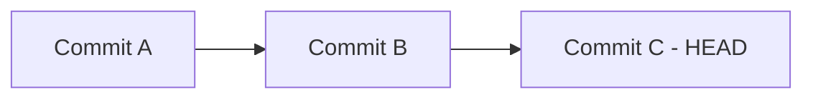

HEAD → commit C (le dernier)

### Mini TD 3 : observer les différences (25 min)

```bash
echo "Ligne 2" >> README.md
git diff

git add README.md
git diff --staged

git commit -m "docs: add second line"
```

**git diff** compare :
- `git diff` : working directory vs staging
- `git diff --staged` : staging vs dernier commit
- `git diff HEAD` : working directory vs dernier commit

Questions :
1. Quelle différence entre `git diff` et `git diff --staged` ?
2. Que se passe-t-il si on lance `git commit` sans `-m` ?

### Mini TD 4 : restaurer et destager (20 min)

```bash
echo "Brouillon" >> README.md
git add README.md

# Retirer du staging
git restore --staged README.md

# Annuler les modifications locales
git restore README.md
```

Questions :
1. Quelle commande annule une modification locale ?
2. Quelle commande retire du staging ?
3. Quelle est la différence entre ces deux opérations ?

### Mini TD 5 : lecture de l'historique (20 min)

```bash
# Dernier commit
git log -1

# Historique court
git log --oneline --decorate -5

# Avec graphe
git log --oneline --graph --all
```

Questions :
1. Quelle différence entre `git log` et `git log --oneline` ?
2. Que représente le hash court ?

### Mini TD 6 : annuler des commits (25 min)

```bash
# Revenir d'un commit (conserve les modifications)
git reset --soft HEAD~1

# Revenir d'un commit (perd les modifications)
git reset --hard HEAD~1

# Créer un nouveau commit qui annule les changements
git revert HEAD
```

:::danger
Attention : `--hard` est **destructif** ! Les modifications sont perdues définitivement. Utilisez `--soft` pour conserver les changements en staging.
:::

### ✅ Ce que l'étudiant doit savoir faire

- Initialiser un dépôt et faire un commit.
- Lire `git status`, `git log` et `git diff`.
- Expliquer le rôle de HEAD.
- Différencier un fichier untracked, modified et staged.
- Utiliser `git restore` pour annuler des changements locaux.
- Annuler un commit avec `git reset`.

### TP 1 : Premier dépôt Git (30 min)

**Objectif** : Créer un dépôt local et effectuer vos premiers commits.

**Énoncé** :
1. Créer un dossier `mon-cv` et initialiser un dépôt Git
2. Créer un fichier `README.md` avec votre nom et présentation
3. Ajouter le fichier au staging et commiter avec un message approprié
4. Modifier le README pour ajouter vos compétences
5. Commiter ce changement
6. Afficher l'historique avec `git log --oneline`

**Bonus** : Créer un fichier `.gitignore` pour ignorer les fichiers temporaires (`.tmp`, `.log`)

---

### TP 2 : Manipuler l'historique (30 min)

**Objectif** : Maîtriser les commandes de base et l'historique.

**Énoncé** :
1. Créer un nouveau dossier `tp-historique` et initialiser un dépôt
2. Créer 3 fichiers : `index.html`, `style.css`, `script.js`
3. Ajouter et commiter `index.html` seul
4. Ajouter et commiter `style.css` seul
5. Modifier `index.html` et commiter
6. Utiliser `git log` pour voir l'historique
7. Utiliser `git diff` pour voir les modifications
8. Défaire le dernier commit avec `--soft`
9. Modifier le message du dernier commit avec `git commit --amend`

**Questions** :
- Quelle est la différence entre `git reset HEAD~1` et `git reset --hard HEAD~1` ?
- À quoi sert le `--amend` ?

### Convention de commits (Conventional Commits)

Un bon message de commit est essentiel pour maintenir un projet professionnel. Il permet de :
- Comprendre l'historique du projet
- Générer automatiquement des changelogs
- Faciliter la recherche dans l'historique

#### Format Conventional Commits

```
<type>(<scope>): <description>

[corps optionnel]

[pied de page optionnel]
```

**Types courants** :

| Type | Description |
|------|-------------|
| `feat` | Nouvelle fonctionnalité |
| `fix` | Correction de bug |
| `docs` | Documentation uniquement |
| `style` | Formatage, sans changement de code |
| `refactor` | Restructuration du code |
| `test` | Ajout/modification de tests |
| `chore` | Tâches de maintenance |
| `perf` | Amélioration performance |
| `ci` | Configuration CI/CD |

**Exemples** :

```bash
# Bon ✓
git commit -m "feat(auth): add password reset flow"
git commit -m "fix: resolve login redirect issue"
git commit -m "docs: update API documentation"
git commit -m "refactor(user): extract validation to service"
git commit -m "test: add unit tests for cart"

# Mauvais ✗
git commit -m "update"
git commit -m "fixed stuff"
```

:::tip
Utilisez l'impératif : "add" pas "added", "fix" pas "fixed". Imaginez que vous terminez une phrase comme "This commit will..."
:::
git commit -m "asdf"
git commit -m "WIP"
```

**Règles d'or** :
1. Première ligne < 50 caractères
2. Utiliser l'impératif : "add" pas "added"
3. Minuscules pour le type
4. Pas de point à la fin
5. Le scope est optionnel mais recommandé

**En pratique (pro)** :
- Commit fréquent et atomique
- Un commit = une idée/changement
- Vérifier avant de pusher avec `git log --oneline`

---

## Branches et workflow (3h)

### 🎯 Objectifs pédagogiques

- Comprendre pourquoi les branches existent.
- Créer, basculer et fusionner des branches.
- Gérer un conflit simple.
- Comprendre rebase sans complexité.

### Pourquoi les branches ?

Une branche permet d'isoler une fonctionnalité sans casser la branche principale.

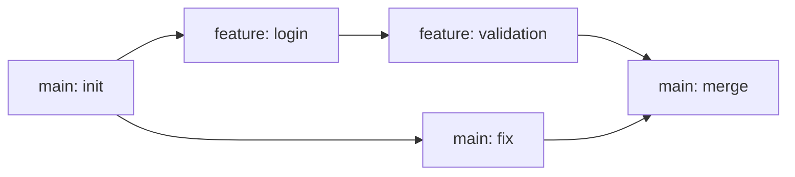

**Avantages** :
- Développement parallèle
- Isolation des expériences
- Revue de code facilitée
- Déploiement indépendant

### Commandes essentielles

```bash
git branch              # Lister les branches
git branch nom          # Créer une branche
git switch nom          # Basculer sur une branche
git switch -c nom       # Créer et basculer
git merge branche       # Fusionner une branche
git rebase branche      # Rebaser sur une branche
```

### Schéma : création de branche

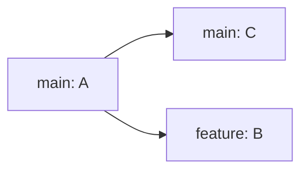

### Schéma : merge

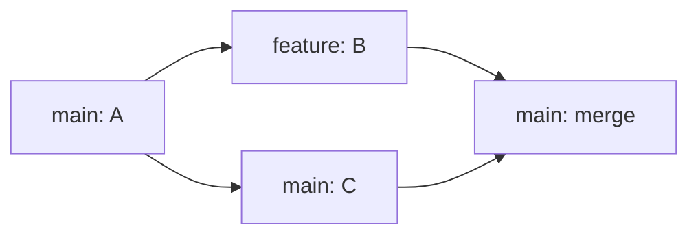

### Schéma : rebase

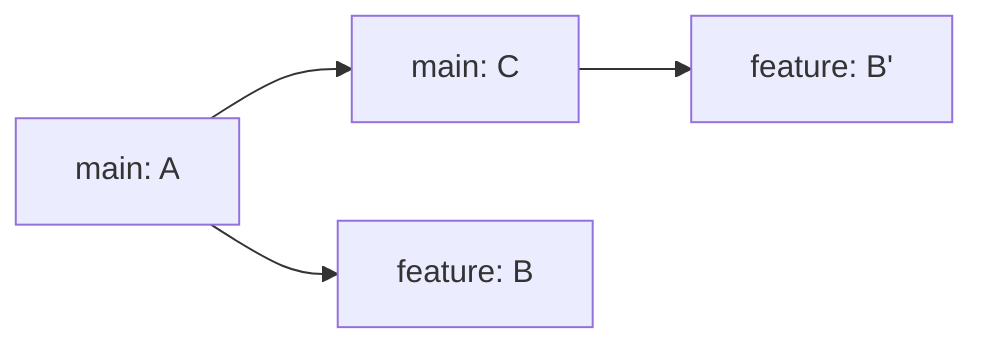

### Schéma : merge

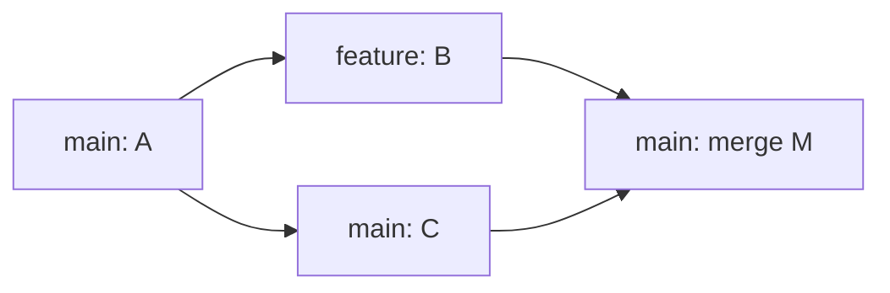

### Schéma : rebase


**Différence merge vs rebase** :
- **Merge** : conserve l'historique, crée un commit de merge
- **Rebase** :线性ise l'historique, réécrit les commits

### Mini TD : branches et merge (45 min)

```bash
git switch -c feature/homepage
echo "<h1>Home</h1>" > index.html
git add index.html
git commit -m "feat: add homepage"

git switch main
git merge feature/homepage
```

### Gérer un conflit (scénario)

1. Deux branches modifient la même ligne
2. `git merge` signale un conflit
3. Ouvrir le fichier, choisir la version
4. `git add` puis `git commit`

**Exemple de conflit** :

```markdown
<<<<<<< HEAD
Titre: Mon Site
=======
Titre: Mon Super Site
>>>>>>> feature/title
```

Résolution :
```markdown
Titre: Mon Super Site
```

### Workflow d'équipe simplifié

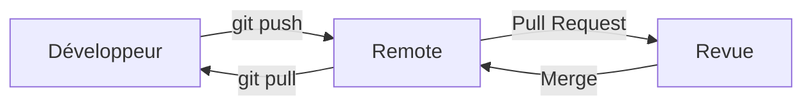

1. Créer une branche `feature/*`
2. Travailler avec des commits progressifs
3. Ouvrir une Pull Request
4. Revue de code
5. Merge dans `main`

### GitFlow (Workflow d'équipe)

GitFlow est un modèle de branches très utilisé en entreprise pour gérer les versions et les publications.

:::note
GitFlow est idéal pour :
- Projets avec cycles de release définis
- Équipes nombreuses
- Nécessité de maintenir plusieurs versions

Pour les petits projets ou CD/CI moderne, **GitHub Flow** (main + features) suffit souvent.
:::

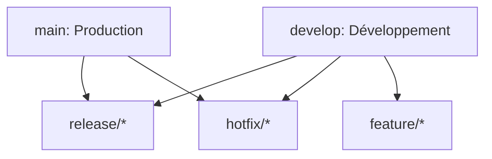

**Branches principales** :

| Branche | Rôle | Durée de vie |
|---------|------|--------------|
| `main` | Production, déployée | Permanente |
| `develop` | Intégration des features | Permanente |

**Branches temporaires** :

| Branche | Créée depuis | Fusionnée vers |
|---------|--------------|----------------|
| `feature/*` | `develop` | `develop` |
| `release/*` | `develop` | `main` + `develop` |
| `hotfix/*` | `main` | `main` + `develop` |

**Commandes GitFlow** :

```bash
# Nouvelle feature
git checkout develop
git checkout -b feature/nom-feature
# travail...
git checkout develop
git merge feature/nom-feature
git branch -d feature/nom-feature

# Release
git checkout develop
git checkout -b release/v1.0.0
# Corrections...
git checkout main
git merge release/v1.0.0
git tag -a v1.0.0 -m "Version 1.0.0"
git checkout develop
git merge release/v1.0.0

# Hotfix
git checkout main
git checkout -b hotfix/correction-urgente
# correction...
git checkout main
git merge hotfix/correction-urgente
git checkout develop
git merge hotfix/correction-urgente
```

**Quand utiliser GitFlow ?**
- Projets avec cycles de release définis
- Équipes nombreuses
- Nécessité de maintenir plusieurs versions

**Alternatives modernes** :
- GitHub Flow : `main` + `feature/*` (plus simple)
- Trunk-Based Development : commits directs sur main

### Merge vs rebase : quand utiliser lequel

| Contexte | Recommandation |
|----------|----------------|
| Branche partagée | **Merge** |
| Branche locale personnelle | **Rebase** possible |
| Historique à garder | **Merge** |
| Historique linéaire souhaité | **Rebase** |
| Branche déjà poussée | **Jamais rebase** |

:::danger
**Jamais de rebase sur une branche partagée !** Cela réécrit l'historique et peut casser le travail des autres développeurs.
:::

### ✅ Ce que l'étudiant doit savoir faire

- Créer et changer de branche avec `git switch`.
- Fusionner une branche avec `git merge`.
- Résoudre un conflit simple.
- Expliquer la différence merge vs rebase.
- Décrire un workflow d'équipe simple.

### TP 3 : Branches et fusion (30 min)

**Objectif** : Maîtriser les branches et les fusions.

**Énoncé** :
1. Créer un dossier `tp-branches` avec un dépôt Git
2. Créer un fichier `produit.txt` avec "Produit: Montre" et commiter sur `main`
3. Créer une branche `feature-prix` et y ajouter "Prix: 99€", commiter
4. Revenir sur `main` et créer une branche `feature-couleur` avec "Couleur: Bleu", commiter
5. Merger `feature-prix` dans `main`
6. Revenir sur `feature-couleur` et rebaser sur `main`
7. Merger `feature-couleur` dans `main`
8. Afficher l'historique avec `git log --oneline --graph --all`

**Challenge** : Créer un conflit en modifiant la même ligne sur deux branches, puis résoudre le conflit.

---

## Travail en équipe et remotes (1h30)

### 🎯 Objectifs pédagogiques

- Comprendre les dépôts distants.
- Synchroniser avec GitHub/GitLab.
- Utiliser les Pull Requests.

### Commandes remotes

```bash
git remote -v              # Lister les remotes
git remote add origin url  # Ajouter un remote
git fetch                  # Récupérer sans fusionner
git pull                   # Fetch + merge
git push                   # Envoyer vers le remote
```

### Schéma : flux de travail collaboratif

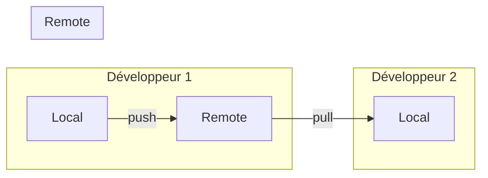

### Configuration d'un remote

:::tip
Le remote par défaut s'appelle conventionnellement `origin`. C'est un simple alias qui pointe vers l'URL du dépôt.
:::

```bash
# Cloner un dépôt existant
git clone https://github.com/user/repo.git

# Ajouter un remote à un dépôt local
git remote add origin https://github.com/user/repo.git

# Pousser pour la première fois
git push -u origin main
```

### Pull Request (MR)

**En local** :
```bash
git switch -c feature/login
# ... travail ...
git push -u origin feature/login
```

**Sur GitHub/GitLab** :
1. Créer une Pull Request
2. Décrire les changements
3. Revue de code
4. Discussions
5. Merge ou close

:::tip
Une Pull Request n'est pas seulement une demande de merge - c'est aussi un espace de discussion et de revue de code. Profitez-en !
:::

### gitignore

Fichiers à ignorer :
- `node_modules/`
- `.env`, `*.env`
- `vendor/`
- `*.log`
- Dossiers caches

```bash
# Créer un .gitignore
echo "node_modules/" >> .gitignore
echo ".env" >> .gitignore
git add .gitignore
git commit -m "chore: add gitignore"
```

Outil : https://www.toptal.com/developers/gitignore

### Stash : ranger temporairement

:::note
Le stash est parfait pour :
- Basculer de branche sans commiter un travail en cours
- Récupérer rapidement des modifications d'une autre branche
- Tester quelque chose temporairement
:::

```bash
# Ranger les modifications
git stash

# Lister les stashs
git stash list

# Récupérer les modifications
git stash pop

# Appliquer sans supprimer
git stash apply
```

**Cas d'usage** : changer de branche sans commiter.

### ✅ Ce que l'étudiant doit savoir faire

- Configurer un remote.
- Pousser et tirer avec `git push` et `git pull`.
- Créer et fermer une Pull Request.
- Utiliser `.gitignore`.
- Utiliser `git stash` pour ranger temporairement.

### TP 4 : Travail collaboratif (30 min)

**Objectif** : Maîtriser les remotes et les Pull Requests.

**Énoncé** :
1. Créer un dépôt local `tp-collab` avec un commit initial
2. Créer un remote GitHub/GitLab (ou simuler avec un dossier)
3. Pousser le dépôt vers le remote
4. Créer une branche `feature-contact`, ajouter un fichier `contact.html`, commiter
5. Pousser la branche vers le remote
6. Simuler une Pull Request (sur GitHub/GitLab ou expliquer les étapes)
7. Revenir sur main, pull les changements, supprimer la branche distante

**Bonus** : Utiliser `git stash` pour basculer rapidement entre deux tâches sans commiter.

---

## TP avancé (1h)

### 🎯 Objectifs pédagogiques

- Appliquer un workflow complet.
- Résoudre un conflit.
- Pratiquer un rebase simple.

### Énoncé

1. Initialiser un dépôt `mini-site`
2. Créer `index.html` et commiter
3. Créer une branche `feature/about`
4. Ajouter `about.html` et un lien
5. Revenir sur `main`, modifier le titre
6. Merger `feature/about`
7. Résoudre le conflit si nécessaire
8. Créer une branche `feature/style`
9. Ajouter `styles.css`
10. Rebaser sur `main`
11. Merger et pousser

### Corrigé

```bash
mkdir mini-site && cd mini-site
git init

cat > index.html <<'EOF'
<!doctype html>
<html lang="fr">
  <head><meta charset="utf-8"><title>Mini Site</title></head>
  <body><h1>Bienvenue</h1></body>
</html>
EOF

git add index.html && git commit -m "init: add homepage"

git switch -c feature/about
cat > about.html <<'EOF'
<!doctype html>
<html lang="fr">
  <head><meta charset="utf-8"><title>À propos</title></head>
  <body><h1>À propos</h1><p>Mini site.</p></body>
</html>
EOF

sed -i '' 's/<h1>Bienvenue<\/h1>/<h1>Bienvenue<\/h1>\n    <a href="about.html">À propos<\/a>/' index.html
git add . && git commit -m "feat: add about page"

git switch main
sed -i '' 's/<title>Mini Site<\/title>/<title>Mini Site - Accueil<\/title>/' index.html
git add . && git commit -m "docs: update title"

git merge feature/about
# Si conflit : éditer, git add, git commit

git switch -c feature/style
echo "body { font-family: sans-serif; }" > styles.css
sed -i '' 's/<\/head>/<link rel="stylesheet" href="styles.css" />\n  <\/head>/' index.html
git add . && git commit -m "feat: add styles"

git switch main
git rebase main
git merge feature/style

git remote add origin https://github.com/user/mini-site.git
git push -u origin main
```

### ✅ Ce que l'étudiant doit savoir faire

- Appliquer un workflow complet.
- Résoudre un conflit.
- Rebaser une branche locale.
- Pousser vers un remote.

---

## TP bonus : Héberger son CV sur GitHub Pages (optionnel)

### 🎯 Objectifs

- Découvrir le déploiement continu avec GitHub Pages
- Créer un CV en ligne professionnel
- Utiliser Git dans un contexte réel et utile

### Prérequis

- Un compte GitHub
- Un dépôt Git local avec votre CV (HTML/CSS)

### Énoncé

#### Étape 1 : Préparer votre projet

1. Créer un dossier `mon-cv` avec votre CV en HTML/CSS
2. Initialiser un dépôt Git et commiter le contenu
3. Créer un dépôt distant sur GitHub

```bash
mkdir mon-cv
cd mon-cv
git init
# Ajouter vos fichiers HTML/CSS du CV
git add .
git commit -m "feat: initial CV"

# Créer le dépôt sur GitHub puis :
git remote add origin https://github.com/votre-login/mon-cv.git
git push -u origin main
```

#### Étape 2 : Activer GitHub Pages

1. Sur GitHub, aller dans Settings > Pages
2. Dans "Build and deployment", sélectionner :
   - Source : **Deploy from a branch**
   - Branch : **main** (ou `gh-pages`)
   - Folder : **/ (root)**
3. Cliquer sur Save
4. Attendre 1-2 minutes pour le déploiement

#### Étape 3 : Personnaliser (bonus)

1. Ajouter un fichier `CNAME` si vous avez un domaine personnalisé
2. Utiliser un thème Jekyll (ajouter `_config.yml`)
3. Ajouter un badge de déploiement dans le README

```yaml
# _config.yml (exemple)
title: Mon CV
description: Mon parcours professionnel
theme: jekyll-theme-minimal
```

#### Étape 4 : Maintenir à jour

```bash
# Après chaque modification du CV
git add .
git commit -m "docs: update work experience"
git push origin main
```

**Votre CV sera automatiquement mis à jour en quelques minutes !**

### Ressources

- [GitHub Pages](https://pages.github.com/)
- [Jekyll Themes](https://jekyllthemes.io/)

---

## QCM final (1h)

### 🎯 Objectifs pédagogiques

- Vérifier la compréhension globale.
- Identifier les zones à retravailler.
- Valider la maîtrise des commandes de base.

### QCM (30 questions)

**Q1.** À quoi sert la zone de staging ?

A. À supprimer des fichiers  
B. À préparer un commit  
C. À créer une branche  
D. À pousser sur le distant

**Q2.** Quelle commande crée un dépôt Git ?

A. `git start`  
B. `git init`  
C. `git create`  
D. `git new`

**Q3.** Quel est le rôle de HEAD ?

A. Pointer vers la branche distante  
B. Pointer vers le commit courant  
C. Lister les commits  
D. Supprimer un commit

**Q4.** Quelle commande affiche les fichiers modifiés non stagés ?

A. `git status`  
B. `git log`  
C. `git show`  
D. `git branch`

**Q5.** Quelle commande ajoute un fichier au staging ?

A. `git save`  
B. `git add`  
C. `git stage --all`  
D. `git include`

**Q6.** `git diff` sans option compare :

A. Staging vs repository  
B. Working directory vs staging  
C. Working directory vs repository  
D. Repository vs remote

**Q7.** Quelle commande affiche l'historique ?

A. `git log`  
B. `git history`  
C. `git list`  
D. `git commits`

**Q8.** Commande moderne pour changer de branche :

A. `git checkout`  
B. `git switch`  
C. `git change`  
D. `git move`

**Q9.** Commande moderne pour restaurer un fichier :

A. `git restore`  
B. `git rollback`  
C. `git clean`  
D. `git reset --hard`

**Q10.** Un commit contient :

A. Uniquement un message  
B. Un instantané et un message  
C. Un tag et un message  
D. Un merge uniquement

**Q11.** Quel choix est le plus adapté pour une branche partagée ?

A. Rebase systématique  
B. Merge pour garder l'historique  
C. Reset --hard  
D. Squash automatique sans accord

**Q12.** Que fait `git merge` ?

A. Crée un tag  
B. Fusionne deux branches  
C. Supprime une branche  
D. Restaure un fichier

**Q13.** Quand un conflit apparaît-il ?

A. Quand deux commits modifient la même zone  
B. Quand on crée une branche  
C. Quand on fait un pull  
D. Quand on ajoute un fichier

**Q14.** Une Pull Request sert à :

A. Installer Git  
B. Demander une revue avant merge  
C. Supprimer une branche  
D. Annuler un commit

**Q15.** Quel message respecte Conventional Commits ?

A. "update"  
B. "feat: add login"  
C. "login feature added"  
D. "hotfix login"

**Q16.** `git restore --staged` sert à :

A. Supprimer un commit  
B. Retirer un fichier du staging  
C. Revenir en arrière d'un commit  
D. Lister l'historique

**Q17.** Commande pour créer et basculer sur une branche :

A. `git branch -c`  
B. `git switch -c`  
C. `git checkout -m`  
D. `git new -b`

**Q18.** `git log --oneline --graph` affiche :

A. Un historique simplifié  
B. Les fichiers modifiés  
C. Les branches distantes  
D. Les conflits

**Q19.** `git add .` ajoute :

A. Tous les fichiers, y compris ignorés  
B. Tous les fichiers suivis et non ignorés  
C. Uniquement les fichiers modifiés  
D. Uniquement le README

**Q20.** Quelle commande permet de voir les différences stagées ?

A. `git diff --staged`  
B. `git diff --cached --local`  
C. `git diff --files`  
D. `git diff --remote`

**Q21.** `git switch main` échoue si :

A. La branche main existe  
B. La branche main n'existe pas  
C. On a des commits  
D. On est sur main

**Q22.** Pour annuler une modification locale d'un fichier, on utilise :

A. `git restore fichier`  
B. `git stash pop`  
C. `git reset fichier`  
D. `git revert fichier`

**Q23.** Le staging permet de :

A. Choisir une partie des modifications  
B. Déployer en production  
C. Vérifier les conflits  
D. Lister les branches

**Q24.** Dans un workflow simple, la branche stable est :

A. `feature/*`  
B. `main`  
C. `bugfix/*`  
D. `test/*`

**Q25.** `git rebase` sert principalement à :

A. Créer un commit de merge  
B. Rejouer des commits pour linéariser  
C. Supprimer un remote  
D. Effacer le dépôt

**Q26.** `git status` indique :

A. L'état du working directory et du staging  
B. L'historique complet  
C. La config globale  
D. Le remote uniquement

**Q27.** Quelle commande enregistre un commit avec message ?

A. `git commit -m "message"`  
B. `git add -m "message"`  
C. `git save -m "message"`  
D. `git message "message"`

**Q28.** Un fichier untracked est :

A. Suivi par Git  
B. Dans le staging  
C. Présent mais pas suivi  
D. Supprimé

**Q29.** Pour changer de branche, on peut utiliser :

A. `git switch`  
B. `git restore`  
C. `git diff`  
D. `git log`

**Q30.** Un bon commit doit être :

A. Le plus gros possible  
B. Cohérent et décrit clairement  
C. Sans message  
D. Fait une fois par jour

### Corrigés détaillés

<details>
<summary>**Q1.** À quoi sert la zone de staging ?</summary>

**Réponse : B**  
Le staging prépare un commit en sélectionnant les changements.
</details>

<details>
<summary>**Q2.** Quelle commande crée un dépôt Git ?</summary>

**Réponse : B**  
`git init` crée un dépôt.
</details>

<details>
<summary>**Q3.** Quel est le rôle de HEAD ?</summary>

**Réponses : B**  
HEAD pointe vers le commit ou la branche courante.
</details>

<details>
<summary>**Q4.** Quelle commande affiche les fichiers modifiés non stagés ?</summary>

**Réponse : A**  
`git status` montre l'état complet.
</details>

<details>
<summary>**Q5.** Quelle commande ajoute un fichier au staging ?</summary>

**Réponse : B**  
`git add` ajoute au staging.
</details>

<details>
<summary>**Q6.** `git diff` sans option compare :</summary>

**Réponse : B**  
`git diff` compare working directory vs staging.
</details>

<details>
<summary>**Q7.** Quelle commande affiche l'historique ?</summary>

**Réponse : A**  
`git log` affiche l'historique.
</details>

<details>
<summary>**Q8.** Commande moderne pour changer de branche :</summary>

**Réponse : B**  
`git switch` est la commande moderne.
</details>

<details>
<summary>**Q9.** Commande moderne pour restaurer un fichier :</summary>

**Réponse : A**  
`git restore` restaure un fichier.
</details>

<details>
<summary>**Q10.** Un commit contient :</summary>

**Réponse : B**  
Un commit = instantané (tree) + message + métadonnées.
</details>

<details>
<summary>**Q11.** Quel choix est le plus adapté pour une branche partagée ?</summary>

**Réponse : B**  
Merge sur branche partagée conserve l'historique.
</details>

<details>
<summary>**Q12.** Que fait `git merge` ?</summary>

**Réponse : B**  
`git merge` fusionne des branches.
</details>

<details>
<summary>**Q13.** Quand un conflit apparaît-il ?</summary>

**Réponse : A**  
Conflit sur la même zone modifiée dans deux branches.
</details>

<details>
<summary>**Q14.** Une Pull Request sert à :</summary>

**Réponse : B**  
PR = revue avant merge.
</details>

<details>
<summary>**Q15.** Quel message respecte Conventional Commits ?</summary>

**Réponse : B**  
Conventional Commits : type(scope): description.
</details>

<details>
<summary>**Q16.** `git restore --staged` sert à :</summary>

**Réponse : B**  
Retire du staging sans perdre les modifications.
</details>

<details>
<summary>**Q17.** Commande pour créer et basculer sur une branche :</summary>

**Réponse : B**  
`git switch -c` crée et bascule.
</details>

<details>
<summary>**Q18.** `git log --oneline --graph` affiche :</summary>

**Réponse : A**  
Historique simplifié avec visualisation des branches.
</details>

<details>
<summary>**Q19.** `git add .` ajoute :</summary>

**Réponse : B**  
Tous les fichiers non ignorés.
</details>

<details>
<summary>**Q20.** Quelle commande permet de voir les différences stagées ?</summary>

**Réponse : A**  
Diff des changements stagés.
</details>

<details>
<summary>**Q21.** `git switch main` échoue si :</summary>

**Réponse : B**  
Échec si branche inexistante.
</details>

<details>
<summary>**Q22.** Pour annuler une modification locale d'un fichier, on utilise :</summary>

**Réponse : A**  
`git restore` annule localement.
</details>

<details>
<summary>**Q23.** Le staging permet de :</summary>

**Réponse : A**  
Sélection fine des changements pour le commit.
</details>

<details>
<summary>**Q24.** Dans un workflow simple, la branche stable est :</summary>

**Réponse : B**  
`main` est la branche stable/production.
</details>

<details>
<summary>**Q25.** `git rebase` sert principalement à :</summary>

**Réponse : B**  
Rejouer pour linéariser l'historique.
</details>

<details>
<summary>**Q26.** `git status` indique :</summary>

**Réponse : A**  
État working directory + staging.
</details>

<details>
<summary>**Q27.** Quelle commande enregistre un commit avec message ?</summary>

**Réponse : A**  
Commit avec message en ligne.
</details>

<details>
<summary>**Q28.** Un fichier untracked est :</summary>

**Réponse : C**  
Présent mais non suivi par Git.
</details>

<details>
<summary>**Q29.** Pour changer de branche, on peut utiliser :</summary>

**Réponse : A**  
`git switch` pour changer de branche.
</details>

<details>
<summary>**Q30.** Un bon commit doit être :</summary>

**Réponse : B**  
Commit cohérent et clair (atomic).
</details>

### ✅ Ce que l'étudiant doit savoir faire

- Répondre à un QCM de validation niveau junior.
- Justifier ses réponses avec les notions vues.
- Identifier ses lacunes à retravailler.
