# Cours Git - 11h (TD)

## Sommaire

- [Introduction (1h)](#introduction-1h)
- [Bases fondamentales (3h)](#bases-fondamentales-3h)
- [Branches et workflow (3h)](#branches-et-workflow-3h)
- [Travail en équipe et remotes (1h30)](#travail-en-équipe-et-remotes-1h30)
- [TP avancé (1h30)](#tp-avancé-1h30)
- [QCM final (1h)](#qcm-final-1h)

---

## Introduction (1h)

### Objectifs pédagogiques

- Comprendre le versioning et ses enjeux.
- Identifier la différence entre systèmes centralisés et décentralisés.
- Installer Git et configurer son identité.
- Définir les concepts fondamentaux de Git.

### Qu'est-ce que le versioning ?

Le **versioning** (ou gestion de versions) permet de suivre l'évolution d'un projet dans le temps, de revenir en arrière si nécessaire, et de collaborer à plusieurs sans risquer d'écraser le travail des autres.

:::tip[Cas concret]
Imaginez que vous travaillez à 5 sur un site web. Sans versioning :
- Vous vous envoyez des fichiers par email → qui détient la dernière version ?
- Vous écrasez le travail des autres → comment récupérer ce qui a été perdu ?
- Pas de retour en arrière → une erreur devient une catastrophe.
:::

### Pourquoi Git ?

- **Distribué** : chaque développeur possède l'historique complet du projet
- **Rapide** : opérations locales instantanées (log, diff, commit)
- **Robuste** : historique vérifiable par hash cryptographique, branchements efficaces
- **Standard industriel** : GitHub, GitLab, Bitbucket, Azure DevOps

### Systèmes centralisés vs décentralisés

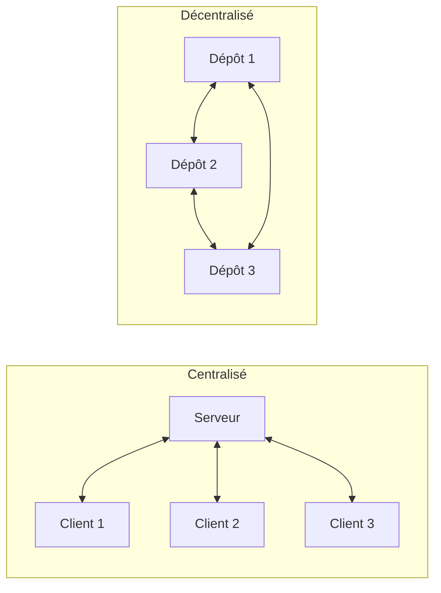

| Type | Exemple | Avantage principal | Limite principale |
|------|---------|-------------------|-------------------|
| Centralisé | SVN, CVS | Simple à administrer | Dépend d'un serveur unique, pas de travail hors ligne |
| Décentralisé | Git, Mercurial | Autonome, copie complète locale, travail hors ligne | Gestion des binaires lourds moins optimale |

:::note[Avantages du décentralisé en environnement professionnel]
- **Autonomie complète** : ne dépend pas d'un serveur central
- **Travail hors ligne** : commit, branche, merge sans connexion
- **Historique complet** : chaque développeur a toute l'histoire du projet
- **Dépôt de référence** : possibilité de désigner un dépôt principal (GitHub, GitLab)
:::

### À propos de Git

**Informations clés** :

- **Première version** : 7 avril 2005
- **Créateur** : Linus Torvalds (créateur du noyau Linux)
- **Licence** : GNU GPL v2 (logiciel libre)
- **Technologies** : C, Shell, Perl, Tcl, Python, C++
- **Dernière version stable** : 2.53.0 (février 2026)

:::note[Pourquoi Git a été créé ?]
Linus Torvalds a créé Git en 2005 pour gérer le développement du noyau Linux après que l'outil précédent (BitKeeper) soit devenu payant. Git a été conçu pour être :
- **Rapide** : opérations en millisecondes
- **Distribué** : pas de point de défaillance unique
- **Fiable** : intégrité cryptographique (SHA-1)
:::

### Installation et configuration

#### Installer Git

- **Windows** : https://git-scm.com/downloads ou `winget install --id Git.Git -e`
- **macOS** : `brew install git` ou Xcode Command Line Tools
- **Linux** : `sudo apt-get install git-all` (Debian/Ubuntu)

#### Configuration de base

:::important[Configuration obligatoire]
La configuration de `user.name` et `user.email` est **obligatoire** pour être identifié dans vos commits. Sans ces informations, Git refusera de créer des commits.

Ces données apparaissent dans chaque commit et identifient l'auteur des modifications.
:::

```bash
# Vérifier la version
git --version

# Configuration globale (obligatoire pour être identifié)
git config --global user.name "Prénom Nom"
git config --global user.email "prenom.nom@email.com"

# Vérifier
git config --global --list
```

**Configuration recommandée** :

```bash
# Définir le nom de la branche principale par défaut 
# (main est la convention moderne, plus master)
git config --global init.defaultBranch main
```

### Configuration avancée

:::note[Niveaux de configuration Git]
Git propose 3 niveaux de configuration (du plus large au plus spécifique) :
- `--system` : pour tous les utilisateurs du système (rarement utilisé)
- `--global` : pour votre compte utilisateur sur tous vos projets
- `--local` : pour le dépôt courant uniquement (prioritaire)

La configuration locale écrase la globale, qui écrase la système.
:::

#### Globale vs Locale

```bash
# Config globale (tous les dépôts)
git config --global user.name "Prénom Nom"
git config --global user.email "email@exemple.com"

# Config locale (dépôt courant uniquement)
git config --local user.name "Prénom Nom"  # Surcharge la globale
git config --local user.email "email@projet.com"

# Voir la config avec ses niveaux
git config --list --show-origin
```

:::tip[Quand utiliser la configuration locale ?]
Utilisez `--local` pour :
- Un projet professionnel avec une adresse email d'entreprise différente
- Tester des configurations sans impacter vos autres projets
- Utiliser des identifiants spécifiques à un client ou projet
:::

#### Créer des alias

Les alias permettent de créer des raccourcis pour les commandes fréquentes et gagner un temps précieux.

```bash
# Raccourcis pratiques
git config --global alias.st "status"           # git st
git config --global alias.co "checkout"         # git co
git config --global alias.br "branch"            # git br
git config --global alias.ci "commit"            # git ci

# Alias avancés
git config --global alias.last "log -1 HEAD"                    # Dernier commit
git config --global alias.graph "log --oneline --graph --all"   # Vue graphique
git config --global alias.undo "reset --soft HEAD~1"            # Annuler dernier commit
git config --global alias.a "add"                               # git a
git config --global alias.aa "add --all"                       # Tout ajouter

# Alias pour les branches
git config --global alias.co-main "checkout main"
git config --global alias.co-develop "checkout develop"
```

#### Personnaliser les couleurs

```bash
# Activer les couleurs
git config --global color.ui auto

# Couleurs spécifiques
git config --global color.branch.current "yellow reverse"
git config --global color.branch.local "yellow"
git config --global color.branch.remote "green"
git config --global color.diff.meta "yellow bold"
git config --global color.diff.frag "magenta bold"
git config --global color.status.added "green"
git config --global color.status.changed "yellow"
git config --global color.status.untracked "red"
```

#### Mode de commit (éditeur)

```bash
# Changer l'éditeur par défaut
git config --global core.editor "code --wait"      # VS Code
git config --global core.editor "nano"              # Nano
git config --global core.editor "vim"               # Vim
git config --global core.editor "subl -n -w"        # Sublime Text

# Utiliser un merge tool
git config --global merge.tool "vimdiff"
git config --global merge.tool "code --wait"

# Définir le pager
git config --global core.pager ""        # Désactiver le pager
git config --global core.pager "less -R" # Activer avec couleurs
```

#### Configuration pour la pratique

```bash
# Configuration complète recommandée
git config --global init.defaultBranch main
git config --global user.name "Prénom Nom"
git config --global user.email "prenom.nom@email.com"
git config --global color.ui auto
git config --global alias.last "log -1 HEAD"
git config --global alias.graph "log --oneline --graph --all"
git config --global alias.st "status"
```

#### Vérifier sa configuration

```bash
# Voir toute la config
git config --global --list

# Voir une valeur précise
git config --global user.name

# Éditer la config directement
git config --global --edit
```

### Concepts fondamentaux

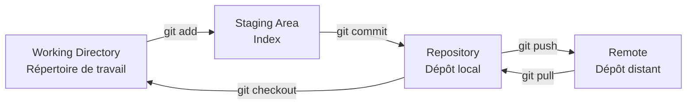

| Concept | Définition |
|---------|------------|
| **Repository** (dépôt) | Espace contenant l'historique complet du projet (dossier `.git/`) |
| **Working Directory** | Dossier visible où vous modifiez les fichiers |
| **Staging Area** (Index) | Zone tampon pour sélectionner ce qui sera commité |
| **Commit** | Instantané versionné avec message descriptif |
| **HEAD** | Pointeur vers le commit/branche actuel(le) |
| **Remote** | Dépôt distant (GitHub, GitLab, Bitbucket) |
| **Branch** | Ligne de développement parallèle |
| **Tag** | Marqueur immuable sur un commit (pour versions/releases) |

### États d'un fichier

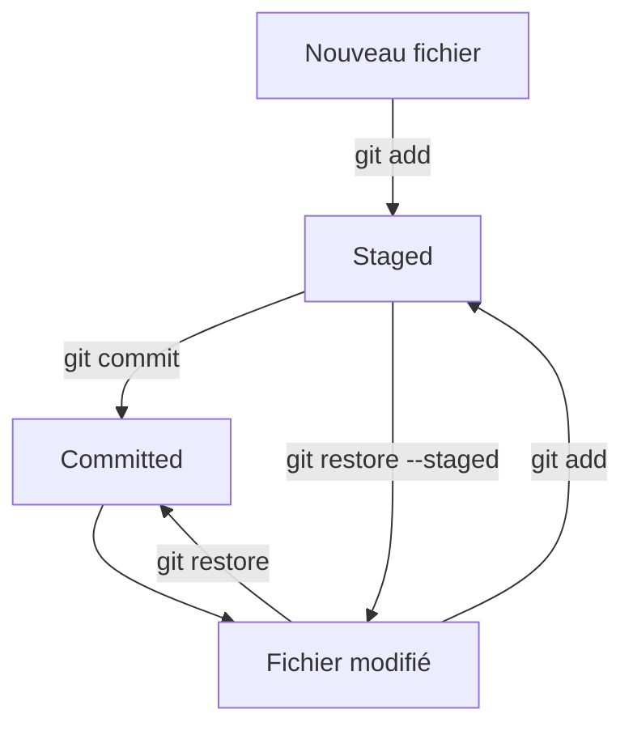

- **Untracked** (non suivi) : nouveau fichier, pas encore ajouté à Git
- **Modified** (modifié) : fichier suivi, modifié mais pas encore ajouté au staging
- **Staged** (indexé) : modification ajoutée à l'index, prête pour le commit
- **Committed** (commité) : enregistré dans l'historique Git

:::tip[Bonne pratique]
Utilisez fréquemment `git status` pour visualiser dans quel état se trouvent vos fichiers. C'est la commande la plus utile au quotidien !
:::

### Mini TD 0 : vérification d'installation (20 min)

1. Vérifier que Git est installé : `git --version`
2. Afficher l'aide générale : `git help`
3. Configurer votre identité en global
4. Vérifier la configuration avec `git config --global --list`
5. Expliquer la différence entre config globale et locale

### Questions d'entraînement (10 min)

1. Pourquoi un dépôt Git est-il utile pour travailler à plusieurs ?
2. Quelle commande permet de voir toutes les commandes Git disponibles ?
3. Où se stocke l'historique Git localement ?
4. Pourquoi renseigner `user.name` et `user.email` ?
5. Citer un avantage et un inconvénients des systèmes centralisés.
6. Pourquoi dit-on que Git est un système décentralisé ?

### Ce que l'étudiant doit savoir faire

- Expliquer le rôle du versioning.
- Distinguer centralisé et décentralisé.
- Installer Git et configurer son identité.
- Définir repository, working directory, staging area, commit et HEAD.
- Vérifier une installation Git et une configuration correcte.
- Expliquer la différence entre dépôt local et distant.
- Identifier les états d'un fichier (untracked, modified, staged).

---

## Bases fondamentales (3h)

### Objectifs pédagogiques

- Créer un dépôt local et enregistrer des changements.
- Comprendre l'état des fichiers et l'historique.
- Utiliser les commandes de base en autonomie.

### ⌨️ Commandes essentielles

```bash
git init      # Crée un dépôt Git
git add       # Ajoute des fichiers au staging
git commit    # Enregistre les changements dans l'historique
git status    # Affiche l'état des fichiers
git log       # Affiche l'historique des commits
git diff      # Affiche les différences entre versions
```

### Anatomie d'un commit

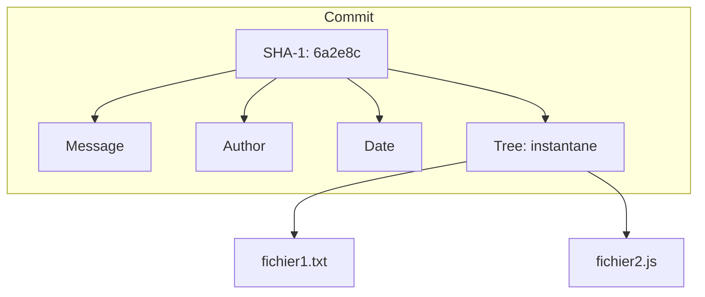

Chaque commit contient :
- **SHA-1** : identifiant unique (40 caractères hexadécimaux, 7 suffisent souvent pour identifier)
- **Auteur** : nom et email du créateur du commit
- **Date** : horodatage précis de la création
- **Message** : description claire du changement apporté
- **Tree** : instantané de l'état des fichiers à ce moment

### Mini TD 1 : créer son premier dépôt (20 min)

Objectif : initialiser un dépôt et comprendre la structure Git.

```bash
mkdir demo-git
cd demo-git
git init
```

Questions :
1. Quel dossier apparaît après `git init` ?
2. Que contient ce dossier `.git` ?

### Mini TD 2 : add et commit (30 min)

```bash
echo "# Mon Projet" > README.md
git status

git add README.md
git status

git commit -m "init: add README"
git log --oneline
```

**Points à observer** :

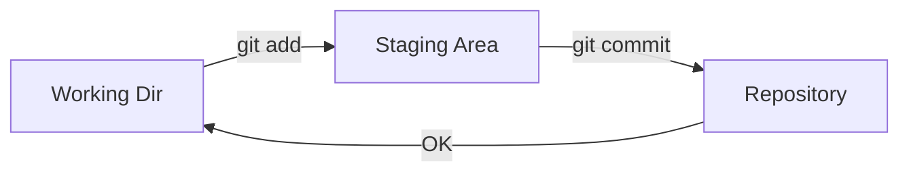

- Avant `git add` : fichier **untracked** (non suivi)
- Après `git add` : fichier **staged** (dans l'index)
- Après `git commit` : fichier **committed** (versionné)

Questions :
1. Quelle commande montre l'état du staging ?
2. Pourquoi un commit doit-il être petit et cohérent ?
3. Quelle est la différence entre `git add .` et `git add fichier` ?

### Comprendre HEAD

HEAD est un pointeur qui indique votre position actuelle dans l'historique Git. C'est une référence vers le dernier commit de la branche sur laquelle vous travaillez.

:::note[Les deux états de HEAD]
HEAD peut pointer vers :
- **Une branche** (cas normal) : HEAD → `main` → dernier commit de main
- **Un commit spécifique** (detached HEAD) : situation temporaire lors de navigation dans l'historique
:::

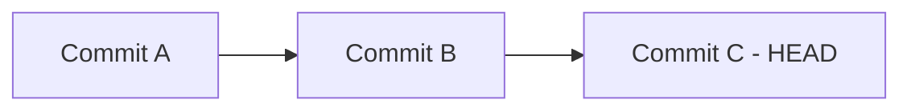

HEAD → commit C (le dernier)

### Mini TD 3 : observer les différences (25 min)

```bash
echo "Ligne 2" >> README.md
git diff

git add README.md
git diff --staged

git commit -m "docs: add second line"
```

**git diff** compare :
- `git diff` : working directory vs staging (changements non indexés)
- `git diff --staged` : staging vs dernier commit (changements prêts à commit)
- `git diff HEAD` : working directory vs dernier commit (tous les changements)

Questions :
1. Quelle différence entre `git diff` et `git diff --staged` ?
2. Que se passe-t-il si on lance `git commit` sans `-m` ?

### Mini TD 4 : restaurer et déstager (20 min)

```bash
echo "Brouillon" >> README.md
git add README.md

# Retirer du staging
git restore --staged README.md

# Annuler les modifications locales
git restore README.md
```

Questions :
1. Quelle commande annule une modification locale ?
2. Quelle commande retire du staging ?
3. Quelle est la différence entre ces deux opérations ?

### Mini TD 5 : lecture de l'historique (20 min)

```bash
# Dernier commit
git log -1

# Historique court
git log --oneline --decorate -5

# Avec graphe
git log --oneline --graph --all
```

Questions :
1. Quelle différence entre `git log` et `git log --oneline` ?
2. Que représente le hash court ?

### Mini TD 6 : annuler des commits (25 min)

```bash
# Revenir d'un commit (conserve les modifications)
git reset --soft HEAD~1

# Revenir d'un commit (perd les modifications)
git reset --hard HEAD~1

# Créer un nouveau commit qui annule les changements
git revert HEAD
```

:::danger[Attention avec --hard]
`git reset --hard` est **destructif** ! Les modifications sont perdues définitivement et irrécupérables.

Préférez `git reset --soft` pour conserver les changements dans le staging, ou `git reset` (mixed, par défaut) pour les conserver dans le working directory.
:::

### Ce que l'étudiant doit savoir faire

- Initialiser un dépôt et faire un commit.
- Lire `git status`, `git log` et `git diff`.
- Expliquer le rôle de HEAD.
- Différencier un fichier untracked, modified et staged.
- Utiliser `git restore` pour annuler des changements locaux.
- Annuler un commit avec `git reset`.

### TP 1 : Premier dépôt Git (30 min)

**Objectif** : Créer un dépôt local et effectuer vos premiers commits.

**Énoncé** :
1. Créer un dossier `mon-cv` et initialiser un dépôt Git
2. Créer un fichier `README.md` avec votre nom et présentation
3. Ajouter le fichier au staging et commiter avec un message approprié
4. Modifier le README pour ajouter vos compétences
5. Commiter ce changement
6. Afficher l'historique avec `git log --oneline`

**Bonus** : Créer un fichier `.gitignore` pour ignorer les fichiers temporaires (`.tmp`, `.log`)

---

### TP 2 : Manipuler l'historique (30 min)

**Objectif** : Maîtriser les commandes de base et l'historique.

**Énoncé** :
1. Créer un nouveau dossier `tp-historique` et initialiser un dépôt
2. Créer 3 fichiers : `index.html`, `style.css`, `script.js`
3. Ajouter et commiter `index.html` seul
4. Ajouter et commiter `style.css` seul
5. Modifier `index.html` et commiter
6. Utiliser `git log` pour voir l'historique
7. Utiliser `git diff` pour voir les modifications
8. Défaire le dernier commit avec `--soft`
9. Modifier le message du dernier commit avec `git commit --amend`

**Questions** :
- Quelle est la différence entre `git reset HEAD~1` et `git reset --hard HEAD~1` ?
- À quoi sert le `--amend` ?

### Convention de commits (Conventional Commits)

Un bon message de commit est essentiel pour maintenir un projet professionnel de qualité. Il permet de :
- Comprendre l'historique du projet d'un coup d'œil
- Générer automatiquement des changelogs et notes de version
- Faciliter la recherche dans l'historique avec des filtres
- Améliorer la collaboration en équipe

#### 📐 Format Conventional Commits

```
<type>(<scope>): <description>

[corps optionnel]

[pied de page optionnel]
```

**Types courants** :

| Type | Description | Exemple |
|------|-------------|----------|
| `feat` | Nouvelle fonctionnalité | Ajout d'un système de login |
| `fix` | Correction de bug | Réparation d'un crash |
| `docs` | Documentation uniquement | Mise à jour du README |
| `style` | Formatage, sans changement de code | Indentation, espaces |
| `refactor` | Restructuration du code | Amélioration de la structure |
| `test` | Ajout/modification de tests | Tests unitaires |
| `chore` | Tâches de maintenance | Mise à jour dépendances |
| `perf` | Amélioration performance | Optimisation algorithme |
| `ci` | Configuration CI/CD | Pipeline GitHub Actions |

**Exemples** :

```bash
# Bon ✓
git commit -m "feat(auth): add password reset flow"
git commit -m "fix: resolve login redirect issue"
git commit -m "docs: update API documentation"
git commit -m "refactor(user): extract validation to service"
git commit -m "test: add unit tests for cart"

# Mauvais ✗
git commit -m "update"
git commit -m "fixed stuff"
git commit -m "asdf"
git commit -m "WIP"
```

:::tip[Règle d'or de la rédaction]
Utilisez l'**impératif présent** : "add" et non "added", "fix" et non "fixed".

Imaginez que vous terminez la phrase : *"This commit will..."* → *"This commit will **add** login feature"*
:::

**🎯 Règles d'or** :
1. Première ligne < 50 caractères (résumé)
2. Utiliser l'impératif présent : "add" et non "added"
3. Minuscules pour le type et la description
4. Pas de point à la fin de la première ligne
5. Le scope est optionnel mais recommandé en équipe

**📈 En pratique (environnement professionnel)** :
- **Commit fréquent et atomique** : un commit = une idée/changement
- **Vérifier avant de pusher** : relire avec `git log --oneline`
- **Squash si nécessaire** : regrouper les commits WIP avant merge
- **Revue par les pairs** : faire valider ses commits en Pull Request

---

## Branches et workflow (3h)

### Objectifs pédagogiques

- Comprendre pourquoi les branches existent.
- Créer, basculer et fusionner des branches.
- Gérer un conflit simple.
- Comprendre rebase sans complexité.

### Pourquoi les branches ?

Une branche permet d'isoler le développement d'une fonctionnalité sans impacter la branche principale (production).

C'est comme créer une version parallèle du projet pour expérimenter en toute sécurité.

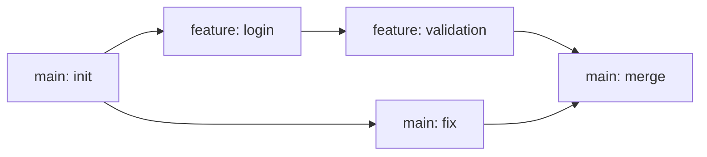

**Avantages** :
- Développement parallèle de plusieurs fonctionnalités
- Isolation complète des expérimentations
- Revue de code facilitée (Pull Request par branche)
- Déploiement indépendant de chaque fonctionnalité

### Commandes essentielles

```bash
git branch              # Lister les branches
git branch nom          # Créer une branche
git switch nom          # Basculer sur une branche
git switch -c nom       # Créer et basculer
git merge branche       # Fusionner une branche
git rebase branche      # Rebaser sur une branche
```

### Schéma : création de branche

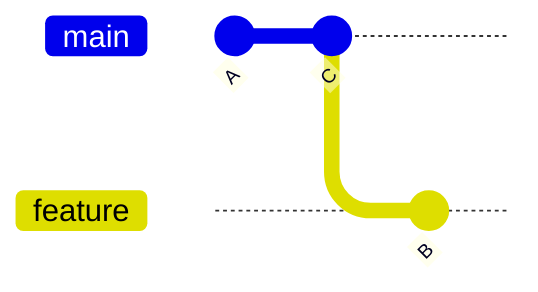

### Schéma : merge

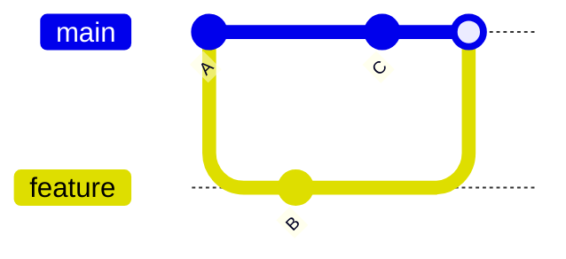

### Schéma : rebase

Avant le rebase :

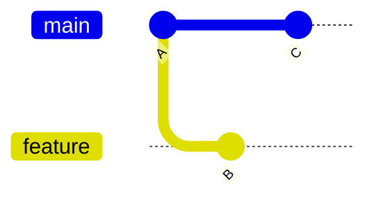

Après le rebase :

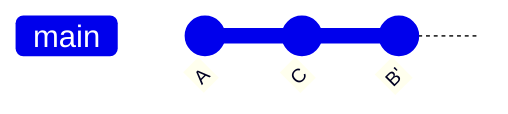

:::note[Différence clé : Merge vs Rebase]
- **Merge** : conserve l'historique complet, crée un commit de fusion visible
- **Rebase** : linéarise l'historique en rejouant les commits, historique plus propre
:::

### Mini TD : branches et merge (45 min)

```bash
git switch -c feature/homepage
echo "<h1>Home</h1>" > index.html
git add index.html
git commit -m "feat: add homepage"

git switch main
git merge feature/homepage
```

### Gérer un conflit (scénario)

1. Deux branches modifient la même ligne
2. `git merge` signale un conflit
3. Ouvrir le fichier, choisir la version
4. `git add` puis `git commit`

**Exemple de conflit** :

```markdown
<<<<<<< HEAD
Titre: Mon Site
=======
Titre: Mon Super Site
>>>>>>> feature/title
```

Résolution :
```markdown
Titre: Mon Super Site
```

### Workflow d'équipe simplifié

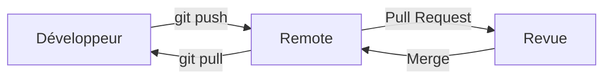

1. Créer une branche `feature/*`
2. Travailler avec des commits progressifs
3. Ouvrir une Pull Request
4. Revue de code
5. Merge dans `main`

### GitFlow (Workflow d'équipe)

GitFlow est un modèle de branches très utilisé en entreprise pour gérer les versions et les publications.

:::note[Quand utiliser GitFlow ?]
GitFlow est idéal pour :
- Projets avec cycles de release bien définis
- Équipes nombreuses (> 5 développeurs)
- Nécessité de maintenir plusieurs versions en production

Pour les petits projets ou avec déploiement continu moderne, **GitHub Flow** (main + features) est souvent plus simple et suffisant.
:::

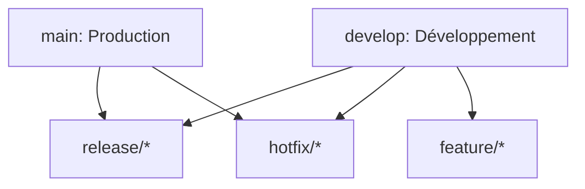

**Branches principales** :

| Branche | Rôle | Durée de vie |
|---------|------|--------------|
| `main` | Production, déployée | Permanente |
| `develop` | Intégration des features | Permanente |

**Branches temporaires** :

| Branche | Créée depuis | Fusionnée vers |
|---------|--------------|----------------|
| `feature/*` | `develop` | `develop` |
| `release/*` | `develop` | `main` + `develop` |
| `hotfix/*` | `main` | `main` + `develop` |

**Commandes GitFlow** :

```bash
# Nouvelle feature
git checkout develop
git checkout -b feature/nom-feature
# travail...
git checkout develop
git merge feature/nom-feature
git branch -d feature/nom-feature

# Release
git checkout develop
git checkout -b release/v1.0.0
# Corrections...
git checkout main
git merge release/v1.0.0
git tag -a v1.0.0 -m "Version 1.0.0"
git checkout develop
git merge release/v1.0.0

# Hotfix
git checkout main
git checkout -b hotfix/correction-urgente
# correction...
git checkout main
git merge hotfix/correction-urgente
git checkout develop
git merge hotfix/correction-urgente
```

**Quand utiliser GitFlow ?**
- Projets avec cycles de release bien définis
- Équipes nombreuses (> 5 personnes)
- Nécessité de maintenir plusieurs versions simultanément

**Alternatives modernes** :
- **GitHub Flow** : `main` + `feature/*` (plus simple, déploiement continu)
- **Trunk-Based Development** : commits directs ou très courtes branches sur main

### Merge vs rebase : quand utiliser lequel ?

| Contexte | Recommandation | Raison |
|----------|----------------|--------|
| Branche partagée avec d'autres | **Merge** | Ne réécrit pas l'historique |
| Branche locale personnelle | **Rebase** possible | Historique plus propre |
| Historique à préserver | **Merge** | Trace complète des fusions |
| Historique linéaire souhaité | **Rebase** | Lecture simplifiée |
| Branche déjà poussée (push) | **Jamais rebase** | Casse le travail des autres |

:::danger[Règle d'or du rebase]
**Jamais de rebase sur une branche partagée ou publique !**

Le rebase réécrit l'historique en modifiant les SHA des commits. Si d'autres développeurs ont basé leur travail sur ces commits, leur historique sera cassé.

**Rebase OK** : branche locale, pas encore poussée  
**Rebase INTERDIT** : branche `main`, `develop`, ou toute branche partagée
:::

### Ce que l'étudiant doit savoir faire

- Créer et changer de branche avec `git switch`.
- Fusionner une branche avec `git merge`.
- Résoudre un conflit simple.
- Expliquer la différence merge vs rebase.
- Décrire un workflow d'équipe simple.

### TP 3 : Branches et fusion (30 min)

**Objectif** : Maîtriser les branches et les fusions.

**Énoncé** :
1. Créer un dossier `tp-branches` avec un dépôt Git
2. Créer un fichier `produit.txt` avec "Produit: Montre" et commiter sur `main`
3. Créer une branche `feature-prix` et y ajouter "Prix: 99€", commiter
4. Revenir sur `main` et créer une branche `feature-couleur` avec "Couleur: Bleu", commiter
5. Merger `feature-prix` dans `main`
6. Revenir sur `feature-couleur` et rebaser sur `main`
7. Merger `feature-couleur` dans `main`
8. Afficher l'historique avec `git log --oneline --graph --all`

**Challenge** : Créer un conflit en modifiant la même ligne sur deux branches, puis résoudre le conflit.

---

## Travail en équipe et remotes (1h30)

### Objectifs pédagogiques

- Comprendre les dépôts distants.
- Synchroniser avec GitHub/GitLab.
- Utiliser les Pull Requests.

### Commandes remotes

```bash
git remote -v              # Lister les remotes
git remote add origin url  # Ajouter un remote
git fetch                  # Récupérer sans fusionner
git pull                   # Fetch + merge
git push                   # Envoyer vers le remote
```

### Schéma : flux de travail collaboratif

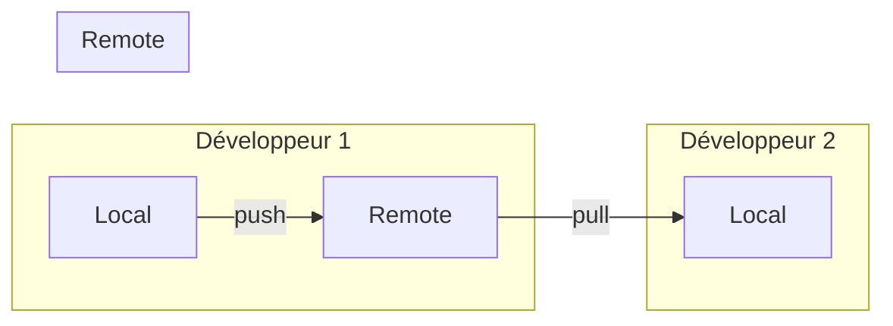

### Configuration d'un remote

:::tip[Qu'est-ce qu'un remote ?]
Le remote par défaut s'appelle conventionnellement `origin`. C'est un simple **alias** qui pointe vers l'URL du dépôt distant.

Vous pouvez avoir plusieurs remotes (origin, upstream, etc.) pour collaborer avec différentes sources.
:::

```bash
# Cloner un dépôt existant
git clone https://github.com/user/repo.git

# Ajouter un remote à un dépôt local
git remote add origin https://github.com/user/repo.git

# Pousser pour la première fois
git push -u origin main
```

### Pull Request (Merge Request sur GitLab)

**En local** :
```bash
git switch -c feature/login
# ... travail ...
git push -u origin feature/login
```

**Sur GitHub/GitLab** :
1. **Créer une Pull Request** depuis l'interface web
2. **Décrire les changements** : contexte, captures d'écran si nécessaire
3. **Revue de code** : les collègues commentent et suggèrent améliorations
4. **Discussions** : répondre aux commentaires, apporter corrections
5. **Merge ou close** : fusion dans la branche cible une fois validée

:::tip[La Pull Request : bien plus qu'un merge]
Une Pull Request n'est pas seulement une demande de fusion - c'est un **espace de collaboration** :
- Revue de code ligne par ligne
- Discussions contextualisées
- Validation par les pairs
- Exécution automatique des tests (CI/CD)
- Documentation des décisions
:::

### gitignore : ignorer des fichiers

**Fichiers à ignorer systématiquement** :
- `node_modules/` : dépendances Node.js
- `.env`, `*.env` : fichiers de configuration sensibles
- `vendor/` : dépendances PHP
- `*.log` : fichiers de logs
- Dossiers caches (`.DS_Store`, `Thumbs.db`)
- Fichiers de build (`dist/`, `build/`)

```bash
# Créer un .gitignore
echo "node_modules/" >> .gitignore
echo ".env" >> .gitignore
echo "*.log" >> .gitignore
git add .gitignore
git commit -m "chore: add gitignore"
```

**Outil recommandé** : https://www.toptal.com/developers/gitignore (générateur de .gitignore)

### Stash : ranger temporairement vos modifications

:::note[Quand utiliser le stash ?]
Le stash est parfait pour :
- Basculer entre branches sans commiter un travail en cours
- Récupérer rapidement des modifications d'une autre branche
- Tester quelque chose temporairement puis revenir à l'état précédent
- Nettoyer le working directory sans perdre les changements
:::

```bash
# Ranger les modifications
git stash

# Lister les stashs
git stash list

# Récupérer les modifications
git stash pop

# Appliquer sans supprimer
git stash apply
```

**🎯 Cas d'usage classique** : changer de branche sans commiter les modifications en cours.

### Ce que l'étudiant doit savoir faire

- Configurer un remote.
- Pousser et tirer avec `git push` et `git pull`.
- Créer et fermer une Pull Request.
- Utiliser `.gitignore`.
- Utiliser `git stash` pour ranger temporairement.

### TP 4 : Travail collaboratif (30 min)

**Objectif** : Maîtriser les remotes et les Pull Requests.

**Énoncé** :
1. Créer un dépôt local `tp-collab` avec un commit initial
2. Créer un remote GitHub/GitLab (ou simuler avec un dossier)
3. Pousser le dépôt vers le remote
4. Créer une branche `feature-contact`, ajouter un fichier `contact.html`, commiter
5. Pousser la branche vers le remote
6. Simuler une Pull Request (sur GitHub/GitLab ou expliquer les étapes)
7. Revenir sur main, pull les changements, supprimer la branche distante

**Bonus** : Utiliser `git stash` pour basculer rapidement entre deux tâches sans commiter.

---

## TP avancé (1h30)

### Objectifs pédagogiques

- Appliquer un workflow complet.
- Résoudre un conflit.
- Pratiquer un rebase simple.

### Énoncé du projet

Vous allez créer un mini-site web avec plusieurs fonctionnalités développées en parallèle.

**📝 Étapes à réaliser** :

1. Initialiser un dépôt `mini-site`
2. Créer `index.html` de base et commiter
3. 🌿 Créer une branche `feature/about`
4. ➕ Ajouter `about.html` et un lien depuis l'accueil
5. 🔙 Revenir sur `main`, modifier le titre de la page
6. 🔄 Merger `feature/about` dans `main`
7. ⚠️ Résoudre le conflit si nécessaire
8. 🌿 Créer une branche `feature/style`
9. 🎨 Ajouter `styles.css` et l'intégrer
10. ➡️ Rebaser `feature/style` sur `main`
11. 🔄 Merger et pousser vers le remote

### 📚 Corrigé détaillé

```bash
# Étape 1 : Initialisation
mkdir mini-site && cd mini-site
git init

# Étape 2 : Créer la page d'accueil

cat > index.html <<'EOF'
<!doctype html>
<html lang="fr">
  <head><meta charset="utf-8"><title>Mini Site</title></head>
  <body><h1>Bienvenue</h1></body>
</html>
EOF

git add index.html && git commit -m "init: add homepage"

git switch -c feature/about
cat > about.html <<'EOF'
<!doctype html>
<html lang="fr">
  <head><meta charset="utf-8"><title>À propos</title></head>
  <body><h1>À propos</h1><p>Mini site.</p></body>
</html>
EOF

sed -i '' 's/<h1>Bienvenue<\/h1>/<h1>Bienvenue<\/h1>\n    <a href="about.html">À propos<\/a>/' index.html
git add . && git commit -m "feat: add about page"

git switch main
sed -i '' 's/<title>Mini Site<\/title>/<title>Mini Site - Accueil<\/title>/' index.html
git add . && git commit -m "docs: update title"

git merge feature/about
# Si conflit : éditer, git add, git commit

git switch -c feature/style
echo "body { font-family: sans-serif; }" > styles.css
sed -i '' 's/<\/head>/<link rel="stylesheet" href="styles.css" />\n  <\/head>/' index.html
git add . && git commit -m "feat: add styles"

git switch main
git rebase main
git merge feature/style

git remote add origin https://github.com/user/mini-site.git
git push -u origin main
```

### Ce que l'étudiant doit savoir faire

- Appliquer un workflow complet.
- Résoudre un conflit.
- Rebaser une branche locale.
- Pousser vers un remote.

---

### 🎯 TP bonus : Héberger son CV sur GitHub Pages (optionnel, 30 min)

### 🎯 Objectifs

- Découvrir le déploiement continu avec GitHub Pages
- Créer un CV en ligne professionnel
- Utiliser Git dans un contexte réel et utile

### Prérequis

- Un compte GitHub
- Un dépôt Git local avec votre CV (HTML/CSS)

### Énoncé

#### Étape 1 : Préparer votre projet

1. Créer un dossier `mon-cv` avec votre CV en HTML/CSS
2. Initialiser un dépôt Git et commiter le contenu
3. Créer un dépôt distant sur GitHub

```bash
mkdir mon-cv
cd mon-cv
git init
# Ajouter vos fichiers HTML/CSS du CV
git add .
git commit -m "feat: initial CV"

# Créer le dépôt sur GitHub puis :
git remote add origin https://github.com/votre-login/mon-cv.git
git push -u origin main
```

#### Étape 2 : Activer GitHub Pages

1. Sur GitHub, aller dans Settings > Pages
2. Dans "Build and deployment", sélectionner :
   - Source : **Deploy from a branch**
   - Branch : **main** (ou `gh-pages`)
   - Folder : **/ (root)**
3. Cliquer sur Save
4. Attendre 1-2 minutes pour le déploiement

#### Étape 3 : Personnaliser (bonus)

1. Ajouter un fichier `CNAME` si vous avez un domaine personnalisé
2. Utiliser un thème Jekyll (ajouter `_config.yml`)
3. Ajouter un badge de déploiement dans le README

```yaml
# _config.yml (exemple)
title: Mon CV
description: Mon parcours professionnel
theme: jekyll-theme-minimal
```

#### Étape 4 : Maintenir à jour

```bash
# Après chaque modification du CV
git add .
git commit -m "docs: update work experience"
git push origin main
```

**Votre CV sera automatiquement mis à jour en quelques minutes !**

### 🔗 Ressources utiles

- 📘 [GitHub Pages Documentation](https://pages.github.com/)
- 🎨 [Jekyll Themes pour CV](https://jekyllthemes.io/)
- 🔧 [GitHub Actions pour automatisation](https://docs.github.com/actions)

---

## QCM final (1h)

### Objectifs pédagogiques

- Vérifier la compréhension globale.
- Identifier les zones à retravailler.
- Valider la maîtrise des commandes de base.

### 📝 QCM (30 questions)

:::note[Instructions]
- Lisez attentivement chaque question
- Une seule réponse correcte par question
- Les corrigés détaillés sont disponibles à la fin
- Durée recommandée : 45 minutes
:::

**Q1.** À quoi sert la zone de staging (index) ?

A. 🗑️ À supprimer des fichiers  
B. À préparer un commit en sélectionnant les changements  
C. 🌿 À créer une branche  
D. 🚀 À pousser vers le dépôt distant

**Q2.** Quelle commande crée un dépôt Git ?

A. `git start`  
B. `git init`  
C. `git create`  
D. `git new`

**Q3.** Quel est le rôle de HEAD ?

A. Pointer vers la branche distante  
B. Pointer vers le commit courant  
C. Lister les commits  
D. Supprimer un commit

**Q4.** Quelle commande affiche les fichiers modifiés non stagés ?

A. `git status`  
B. `git log`  
C. `git show`  
D. `git branch`

**Q5.** Quelle commande ajoute un fichier au staging ?

A. `git save`  
B. `git add`  
C. `git stage --all`  
D. `git include`

**Q6.** `git diff` sans option compare :

A. Staging vs repository  
B. Working directory vs staging  
C. Working directory vs repository  
D. Repository vs remote

**Q7.** Quelle commande affiche l'historique ?

A. `git log`  
B. `git history`  
C. `git list`  
D. `git commits`

**Q8.** Commande moderne pour changer de branche :

A. `git checkout` (ancienne syntaxe)  
B. `git switch` ✅  
C. `git change`  
D. `git move`

**Q9.** Commande moderne pour restaurer un fichier :

A. `git restore`  
B. `git rollback`  
C. `git clean`  
D. `git reset --hard`

**Q10.** Un commit contient :

A. Uniquement un message  
B. Un instantané et un message  
C. Un tag et un message  
D. Un merge uniquement

**Q11.** Quel choix est le plus adapté pour une branche partagée ?

A. Rebase systématique  
B. Merge pour garder l'historique  
C. Reset --hard  
D. Squash automatique sans accord

**Q12.** Que fait `git merge` ?

A. Crée un tag  
B. Fusionne deux branches  
C. Supprime une branche  
D. Restaure un fichier

**Q13.** Quand un conflit apparaît-il ?

A. Quand deux commits modifient la même zone  
B. Quand on crée une branche  
C. Quand on fait un pull  
D. Quand on ajoute un fichier

**Q14.** Une Pull Request sert à :

A. Installer Git  
B. Demander une revue avant merge  
C. Supprimer une branche  
D. Annuler un commit

**Q15.** Quel message respecte Conventional Commits ?

A. "update"  
B. "feat: add login"  
C. "login feature added"  
D. "hotfix login"

**Q16.** `git restore --staged` sert à :

A. Supprimer un commit  
B. Retirer un fichier du staging  
C. Revenir en arrière d'un commit  
D. Lister l'historique

**Q17.** Commande pour créer et basculer sur une branche :

A. `git branch -c`  
B. `git switch -c`  
C. `git checkout -m`  
D. `git new -b`

**Q18.** `git log --oneline --graph` affiche :

A. Un historique simplifié  
B. Les fichiers modifiés  
C. Les branches distantes  
D. Les conflits

**Q19.** `git add .` ajoute :

A. Tous les fichiers, y compris ignorés  
B. Tous les fichiers suivis et non ignorés  
C. Uniquement les fichiers modifiés  
D. Uniquement le README

**Q20.** Quelle commande permet de voir les différences stagées ?

A. `git diff --staged`  
B. `git diff --cached --local`  
C. `git diff --files`  
D. `git diff --remote`

**Q21.** `git switch main` échoue si :

A. La branche main existe  
B. La branche main n'existe pas  
C. On a des commits  
D. On est sur main

**Q22.** Pour annuler une modification locale d'un fichier, on utilise :

A. `git restore fichier`  
B. `git stash pop`  
C. `git reset fichier`  
D. `git revert fichier`

**Q23.** Le staging permet de :

A. Choisir une partie des modifications  
B. Déployer en production  
C. Vérifier les conflits  
D. Lister les branches

**Q24.** Dans un workflow simple, la branche stable est :

A. `feature/*`  
B. `main`  
C. `bugfix/*`  
D. `test/*`

**Q25.** `git rebase` sert principalement à :

A. Créer un commit de merge  
B. Rejouer des commits pour linéariser  
C. Supprimer un remote  
D. Effacer le dépôt

**Q26.** `git status` indique :

A. L'état du working directory et du staging  
B. L'historique complet  
C. La config globale  
D. Le remote uniquement

**Q27.** Quelle commande enregistre un commit avec message ?

A. `git commit -m "message"`  
B. `git add -m "message"`  
C. `git save -m "message"`  
D. `git message "message"`

**Q28.** Un fichier untracked est :

A. Suivi par Git  
B. Dans le staging  
C. Présent mais pas suivi  
D. Supprimé

**Q29.** Pour changer de branche, on peut utiliser :

A. `git switch`  
B. `git restore`  
C. `git diff`  
D. `git log`

**Q30.** Un bon commit doit être :

A. Le plus gros possible  
B. Cohérent et décrit clairement  
C. Sans message  
D. Fait une fois par jour

### 📚 Corrigés détaillés

<details>
<summary>**Q1.** À quoi sert la zone de staging (index) ?</summary>

**Réponse : B**  

Le staging (ou index) est une zone intermédiaire qui prépare un commit en sélectionnant précisément les changements à inclure. Cela permet de créer des commits atomiques et cohérents.
</details>

<details>
<summary>**Q2.** Quelle commande crée un dépôt Git ?</summary>

**Réponse : B**

`git init` initialise un nouveau dépôt Git dans le répertoire courant en créant le dossier caché `.git/` qui contiendra tout l'historique.
</details>

<details>
<summary>**Q3.** Quel est le rôle de HEAD ?</summary>

**Réponse : B**

HEAD est un pointeur qui indique où vous vous trouvez dans l'historique Git. Il pointe généralement vers la branche courante, qui elle-même pointe vers le dernier commit de cette branche.
</details>

<details>
<summary>**Q4.** Quelle commande affiche les fichiers modifiés non stagés ?</summary>

**Réponse : A**

`git status` affiche l'état complet du dépôt : fichiers modifiés, stagés, non suivis, branche courante, etc. C'est la commande la plus utile au quotidien.
</details>

<details>
<summary>**Q5.** Quelle commande ajoute un fichier au staging ?</summary>

**Réponse : B**

`git add` ajoute des fichiers à la zone de staging (index). Vous pouvez ajouter un fichier spécifique (`git add fichier.txt`) ou tous les fichiers modifiés (`git add .`).
</details>

<details>
<summary>**Q6.** `git diff` sans option compare :</summary>

**Réponse : B**

`git diff` (sans option) compare le working directory (vos fichiers actuels) avec le staging area (ce qui est prêt à être commité). Pour voir les changements stagés, utilisez `git diff --staged`.
</details>

<details>
<summary>**Q7.** Quelle commande affiche l'historique ?</summary>

**Réponse : A**

`git log` affiche l'historique des commits. Options utiles : `--oneline` (vue compacte), `--graph` (visualisation graphique), `--all` (toutes les branches).
</details>

<details>
<summary>**Q8.** Commande moderne pour changer de branche :</summary>

**Réponse : B**

`git switch` est la commande moderne introduite dans Git 2.23 (2019) pour changer de branche. Elle remplace `git checkout` qui était ambiguë (servait à trop de choses).
</details>

<details>
<summary>**Q9.** Commande moderne pour restaurer un fichier :</summary>

**Réponse : A**

`git restore` est la commande moderne pour restaurer des fichiers. Elle sépare clairement la restauration du changement de branche (anciennement tous deux faits par `checkout`).
</details>

<details>
<summary>**Q10.** Un commit contient :</summary>

**Réponse : B**

Un commit contient un instantané complet des fichiers (tree), un message descriptif, l'auteur, la date, et une référence au(x) commit(s) parent(s). Tout cela est identifié par un hash SHA-1 unique.
</details>

<details>
<summary>**Q11.** Quel choix est le plus adapté pour une branche partagée ?</summary>

**Réponse : B**

Sur une branche partagée (main, develop), toujours utiliser **merge**. Le rebase réécrit l'historique et casserait le travail des autres développeurs.
</details>

<details>
<summary>**Q12.** Que fait `git merge` ?</summary>

**Réponse : B**

`git merge` fusionne une branche dans la branche courante. Il crée un nouveau commit de fusion (merge commit) qui a deux parents, préservant ainsi tout l'historique.
</details>

<details>
<summary>**Q13.** Quand un conflit apparaît-il ?</summary>

**Réponse : A**

Un conflit survient quand deux branches ont modifié la même zone d'un fichier de façon différente. Git ne peut pas choisir automatiquement quelle version garder, c'est à vous de décider.
</details>

<details>
<summary>**Q14.** Une Pull Request sert à :</summary>

**Réponse : B**

Une Pull Request (ou Merge Request sur GitLab) est une demande de revue de code avant de fusionner une branche. C'est un espace de collaboration avec discussions, commentaires et validation par les pairs.
</details>

<details>
<summary>**Q15.** Quel message respecte Conventional Commits ?</summary>

**Réponse : B**

Conventional Commits suit le format : `type(scope): description`. Exemple : `feat(auth): add login`. Cela permet de générer des changelogs automatiquement et de comprendre l'historique rapidement.
</details>

<details>
<summary>**Q16.** `git restore --staged` sert à :</summary>

**Réponse : B**

`git restore --staged fichier` retire un fichier du staging sans perdre les modifications locales. Le fichier reste modifié mais n'est plus prêt à être commité.
</details>

<details>
<summary>**Q17.** Commande pour créer et basculer sur une branche :</summary>

**Réponse : B**

`git switch -c nom-branche` crée une nouvelle branche ET bascule dessus en une seule commande. Équivalent moderne de `git checkout -b`.
</details>

<details>
<summary>**Q18.** `git log --oneline --graph` affiche :</summary>

**Réponse : A**

Cette commande affiche un historique compact et visuel avec une représentation graphique des branches et fusions. Très utile pour comprendre la structure du projet.
</details>

<details>
<summary>**Q19.** `git add .` ajoute :</summary>

**Réponse : B**

`git add .` ajoute tous les fichiers modifiés et nouveaux du répertoire courant, SAUF ceux listés dans `.gitignore`. Les fichiers ignorés ne sont jamais ajoutés.
</details>

<details>
<summary>**Q20.** Quelle commande permet de voir les différences stagées ?</summary>

**Réponse : A**

`git diff --staged` (ou `--cached`) montre les différences entre le staging et le dernier commit. C'est ce qui sera inclus dans le prochain commit.
</details>

<details>
<summary>**Q21.** `git switch main` échoue si :</summary>

**Réponse : B**

La commande échoue si la branche `main` n'existe pas. Pour créer ET basculer sur une nouvelle branche, utilisez `git switch -c main`.
</details>

<details>
<summary>**Q22.** Pour annuler une modification locale d'un fichier, on utilise :</summary>

**Réponse : A**

`git restore fichier` annule les modifications locales d'un fichier et le restaure à l'état du dernier commit. Attention : les modifications sont perdues définitivement !
</details>

<details>
<summary>**Q23.** Le staging permet de :</summary>

**Réponse : A**

Le staging permet de sélectionner finement les modifications à inclure dans un commit. Vous pouvez commiter une partie seulement de vos changements, créant ainsi des commits atomiques et cohérents.
</details>

<details>
<summary>**Q24.** Dans un workflow simple, la branche stable est :</summary>

**Réponse : B**

`main` (anciennement `master`) est la branche stable par convention. Elle représente le code en production ou prêt à être déployé. Les features se développent sur des branches séparées.
</details>

<details>
<summary>**Q25.** `git rebase` sert principalement à :</summary>

**Réponse : B**

`git rebase` rejoue vos commits au-dessus d'une autre branche, linéarisant ainsi l'historique. Utile sur des branches locales, mais JAMAIS sur des branches partagées car il réécrit l'historique.
</details>

<details>
<summary>**Q26.** `git status` indique :</summary>

**Réponse : A**

`git status` est LA commande essentielle qui montre l'état complet : branche courante, fichiers modifiés, stagés, non suivis, conflits éventuels. À utiliser constamment !
</details>

<details>
<summary>**Q27.** Quelle commande enregistre un commit avec message ?</summary>

**Réponse : A**

`git commit -m "message"` crée un commit avec le message en ligne de commande. Sans `-m`, Git ouvre un éditeur pour rédiger un message plus détaillé.
</details>

<details>
<summary>**Q28.** Un fichier untracked est :</summary>

**Réponse : C**

Un fichier **untracked** (non suivi) est présent dans votre dossier mais Git ne le surveille pas encore. Utilisez `git add` pour commencer à le suivre.
</details>

<details>
<summary>**Q29.** Pour changer de branche, on peut utiliser :</summary>

**Réponse : A**

`git switch` est la commande moderne et explicite pour changer de branche. Elle remplace avantageusement `git checkout` qui était trop polyvalent et prêtait à confusion.
</details>

<details>
<summary>**Q30.** Un bon commit doit être :</summary>

**Réponse : B**

Un bon commit est **atomique** (une seule idée/changement), possède un message clair et descriptif, et peut être compris sans contexte supplémentaire. Qualité > quantité !
</details>

### Ce que l'étudiant doit savoir faire

- Répondre à un QCM de validation niveau junior
- Justifier ses réponses avec les notions vues dans le cours
- Identifier ses lacunes et axes d'amélioration
- Progresser vers l'autonomie sur Git

---

## Conclusion du cours

Félicitations ! Vous avez maintenant toutes les bases pour travailler efficacement avec Git au quotidien.

### Ce que vous maîtrisez désormais

- **Fondamentaux** : init, add, commit, status, log, diff
- **Branches** : création, fusion, résolution de conflits
- **Collaboration** : remotes, push, pull, Pull Requests
- **Bonnes pratiques** : Conventional Commits, GitFlow, revue de code
- **Outils modernes** : git switch, git restore

### Pour aller plus loin

#### Ressources officielles
- [Documentation Git officielle](https://git-scm.com/doc)
- [Pro Git Book (gratuit)](https://git-scm.com/book/fr/v2)
- [Git Cheat Sheet](https://education.github.com/git-cheat-sheet-education.pdf)

#### Pratique interactive
- [Learn Git Branching](https://learngitbranching.js.org/?locale=fr_FR) - Exercices interactifs
- [Git Katas](https://github.com/eficode-academy/git-katas) - Exercices pratiques
- [Oh My Git!](https://ohmygit.org/) - Jeu pour apprendre Git

#### Sujets avancés
- Git hooks (automatisation)
- Git bisect (recherche de bugs)
- Git reflog (récupération d'urgence)
- Git submodules (dépendances)
- Git worktree (espaces de travail multiples)

### Conseils finaux

:::tip[La clé du succès : la pratique !]
- **Pratiquez quotidiennement** : utilisez Git sur tous vos projets
- **Lisez les messages d'erreur** : Git est explicite, apprenez à déchiffrer ses messages
- **Collaborez** : contribuez à des projets open source pour gagner en expérience
- **Expérimentez** : créez des dépôts de test pour essayer de nouvelles commandes
- **Partagez** : enseignez Git à d'autres, c'est le meilleur moyen de consolider vos connaissances
:::

Bon courage dans votre apprentissage de Git !
