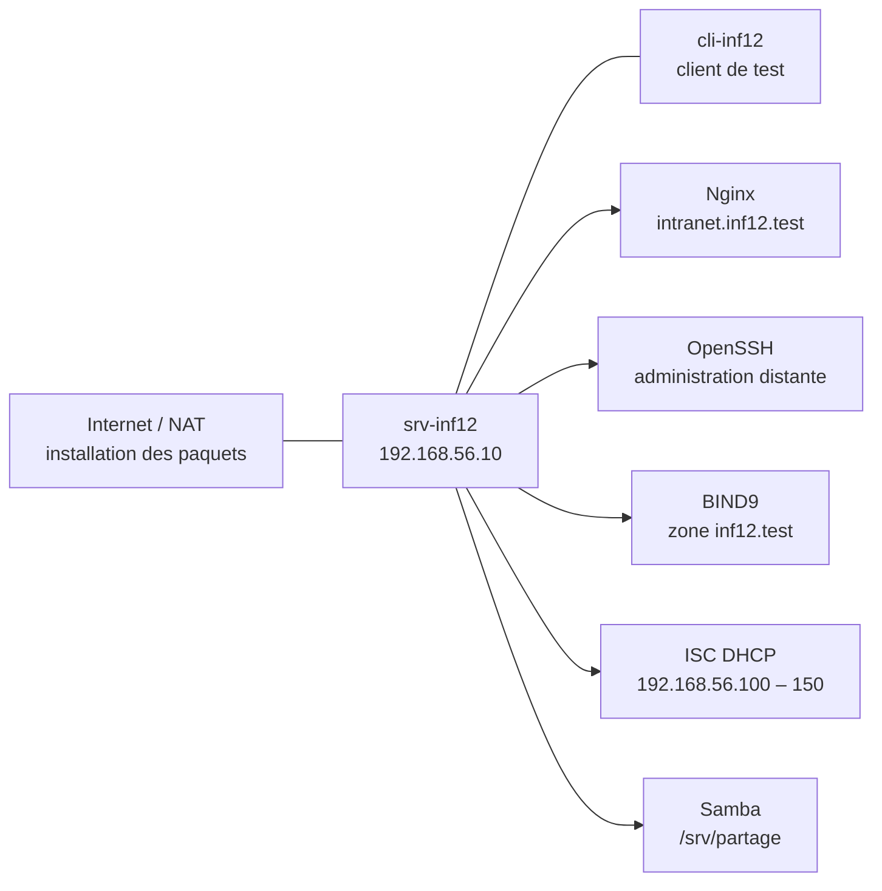
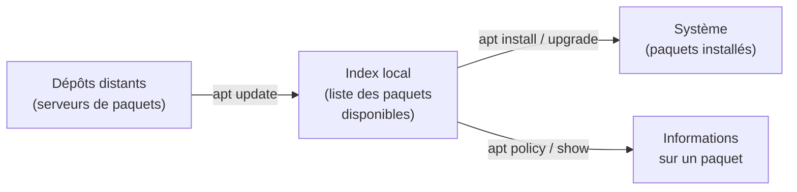
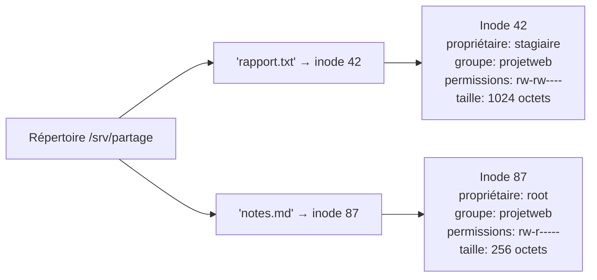
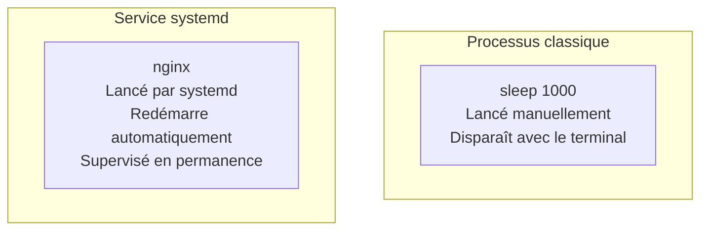
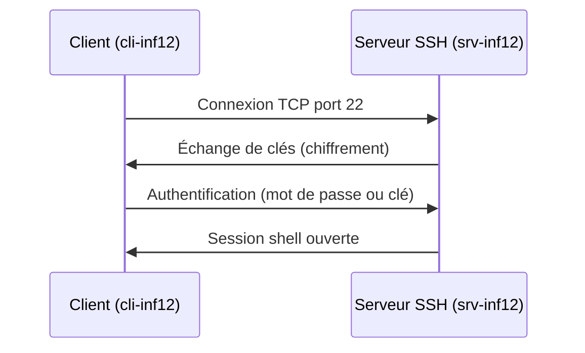
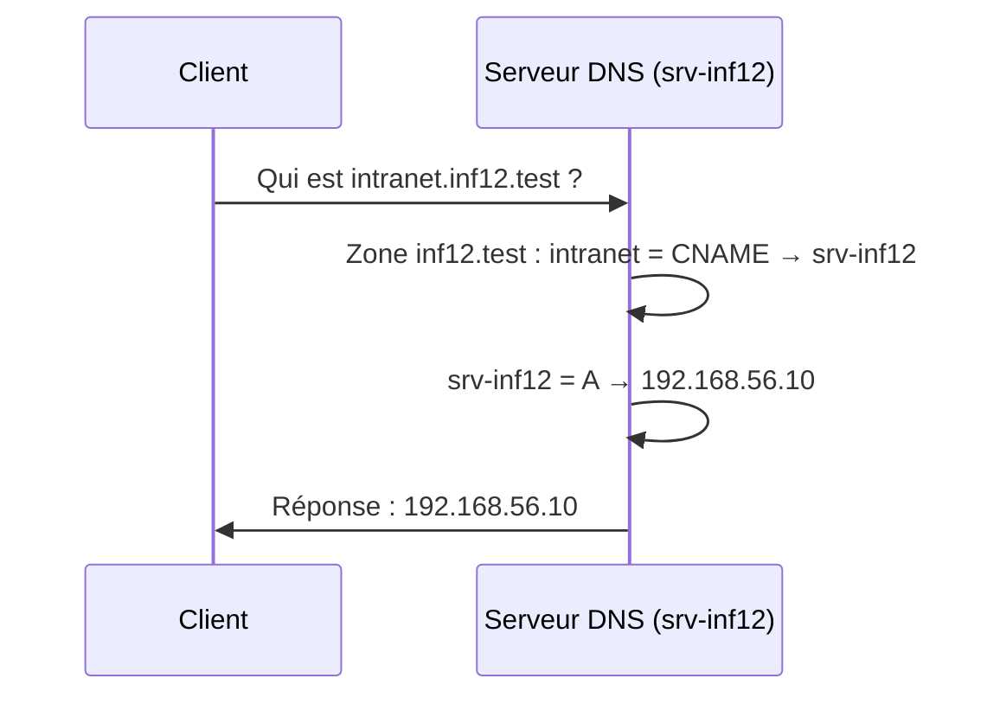
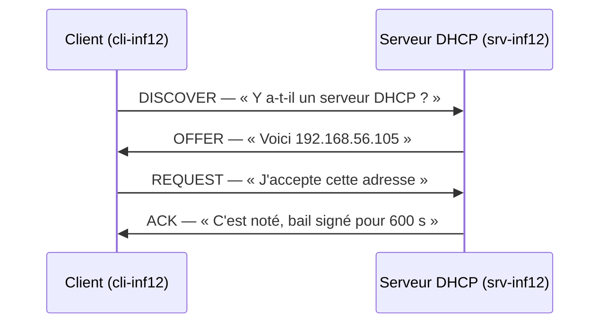

import { Card, CardGrid, Steps, Tabs, TabItem } from '@astrojs/starlight/components';

<div class="duration-badge">⏱️ Durée estimée : 7h</div>

Ce document est votre **guide de mission** pour la journée. Il mêle **cours**, **TP guidés** et **exercices pratiques** autour d'un fil rouge concret : transformer une machine Linux en serveur de lab.

Chaque mission est **indépendante**. Si vous maîtrisez déjà une partie, vérifiez rapidement l'existant et passez à la suivante.

Le but n'est pas de recopier des commandes : c'est de **comprendre ce que vous configurez, pourquoi, et comment prouver que ça fonctionne**.

## 🎯 Objectifs de la journée

<CardGrid stagger>
  <Card title="Maintenir le système" icon="setting">
    Identifier la distribution, gérer les paquets avec APT, installer un logiciel depuis un dépôt tiers.
  </Card>
  <Card title="Gérer comptes et groupes" icon="users">
    Comprendre `root`, créer un utilisateur et un groupe, vérifier les identités.
  </Card>
  <Card title="Maîtriser les permissions" icon="lock">
    Lire des droits, changer propriétaire et groupe, exploiter le SGID sur un répertoire partagé.
  </Card>
  <Card title="Administrer les services" icon="rocket">
    Distinguer processus et service, lire les journaux, configurer et redémarrer proprement.
  </Card>
  <Card title="Rendre le serveur joignable" icon="laptop">
    Configurer une IP statique, vérifier la connectivité, administrer en SSH.
  </Card>
  <Card title="Déployer les services réseau" icon="globe">
    Publier une zone DNS, distribuer l'IP en DHCP, partager un dossier via Samba.
  </Card>
</CardGrid>

En fin de journée, vous devez être capable de **décrire ce que vous avez configuré**, **justifier pourquoi** et **prouver que cela fonctionne**.

## 🧱 Fil rouge — Le mini intranet

Vous reprenez un petit serveur Linux destiné à une équipe projet. L'équipe a besoin :

- d'un système à jour ;
- d'un compte d'administration technique ;
- d'un espace de fichiers partagé ;
- d'un **mini intranet** visible dans un navigateur ;
- d'un accès distant en **SSH** ;
- d'une résolution de noms locale ;
- d'une distribution automatique des paramètres réseau.

Votre mission : **transformer cette machine en serveur de lab propre, compréhensible et administrable**.



## 🧰 Les outils de la journée

| Outil | Ce qu'il fait | Commandes principales |
|---|---|---|
| **APT** | Installe et met à jour les logiciels | `apt update`, `apt install`, `apt policy` |
| **systemd** | Lance, arrête et supervise les services | `systemctl status`, `systemctl restart`, `systemctl enable --now` |
| **journalctl** | Lit les journaux des services | `journalctl -u nginx -xe` |
| **OpenSSH** | Administration distante chiffrée | `ssh utilisateur@ip`, `ssh-keygen` |
| **Nginx** | Serveur web | `nginx -t`, `systemctl reload nginx` |
| **BIND9** | Serveur DNS | `named-checkconf`, `named-checkzone`, `dig` |
| **ISC DHCP** | Serveur DHCP | `dhcpd -t -cf ...`, `systemctl restart isc-dhcp-server` |
| **Samba** | Partage de fichiers réseau | `testparm`, `smbpasswd -a`, `smbclient` |
| **iproute2 / ss** | Diagnostic réseau | `ip -br a`, `ip route`, `ss -lntp` |

## 🕒 Organisation sur 7h

| Séquence | Thème | Durée |
|---|---|---:|
| 0 | Mise en route et rappel de méthode | 15 min |
| 1 | Maintenance Linux et gestion des paquets | 45 min |
| 2 | Utilisateurs, groupes et mot de passe `root` | 45 min |
| 3 | Permissions, propriétaires, inodes | 60 min |
| 4 | Processus, signaux, journaux, serveur web | 60 min |
| 5 | Réseau local, IP statique, SSH | 45 min |
| 6 | DNS + DHCP | 90 min |
| 7 | Partage réseau avec Samba | 45 min |
| 8 | Validation finale / challenge | 15 min |

:::note[Règle d'or]
Travaillez **par étapes courtes** avec **test immédiat** après chaque modification. L'erreur classique consiste à modifier trois choses en même temps, puis à ne plus savoir ce qui a cassé.
:::

## 🛠️ Méthode de travail

Quand vous modifiez un système, adoptez toujours ce cycle « observer → modifier → vérifier → tester » issu des bonnes pratiques d'administration système ([The Practice of System and Network Administration](https://the-sysadmin-book.com/)) :

<Steps>

1. **Observer** l'état actuel avant toute modification.

2. **Modifier** un seul élément à la fois.

3. **Vérifier la syntaxe** si un fichier de configuration est concerné.

4. **Redémarrer ou recharger** le service proprement.

5. **Tester côté serveur**, puis **tester côté client**.

6. **Lire les journaux** en cas d'échec.

</Steps>

## 🧪 Maquette de laboratoire

Pour éviter tout incident, le service **DHCP** doit être testé sur un **réseau isolé**.

### Topologie

- **Serveur Linux** : `srv-inf12`
  - une interface pour Internet/NAT (installation des paquets) ;
  - une interface pour le réseau de TP isolé.
- **Client Linux** : `cli-inf12`
  - une interface sur le réseau de TP isolé.

### Plan d'adressage

| Élément | Valeur |
|---|---|
| Réseau de TP | `192.168.56.0/24` |
| IP du serveur sur le LAN de TP | `192.168.56.10/24` |
| Nom du serveur | `srv-inf12` |
| Zone DNS | `inf12.test` |
| FQDN du serveur | `srv-inf12.inf12.test` |
| Alias web | `intranet.inf12.test` |
| Plage DHCP | `192.168.56.100` à `192.168.56.150` |

:::tip[Pourquoi `.test` ?]
Le suffixe `.test` est [réservé par l'IETF (RFC 6761)](https://www.rfc-editor.org/rfc/rfc6761) pour les scénarios de démonstration. Il ne sera jamais attribué comme vrai domaine, ce qui évite toute collision avec un nom public.
:::

## ⚡ Commandes réflexes

Gardez ces commandes sous la main pendant toute la journée :

```bash
whoami                              # Qui suis-je ?
id                                  # UID, GID, groupes
pwd                                 # Répertoire courant
hostnamectl                         # Nom de la machine et distribution
ip -br a                            # Interfaces et adresses IP
ip route                            # Table de routage
ss -lntup                           # Ports à l'écoute
ps -ef                              # Processus en cours
systemctl status <service>          # État d'un service
sudo journalctl -u <service> -xe    # Journaux d'un service
ls -li                              # Fichiers avec numéro d'inode
stat <fichier>                      # Métadonnées détaillées
```

---

## Mission 1 — Maintenir le système Linux

### Situation

Avant de rendre un service, un administrateur commence par vérifier le terrain : quelle distribution utilise-t-on ? Les index sont-ils à jour ? Les outils nécessaires sont-ils installés ?

### Notions de cours

#### Distribution, paquets et dépôts

Une distribution Linux assemble :

- un **noyau Linux** ;
- des **paquets logiciels** (programmes, bibliothèques, documentation) ;
- des **règles d'installation et de maintenance**.

Sous Debian et Ubuntu, les logiciels sont installés sous forme de **paquets `.deb`** gérés par **APT** (Advanced Package Tool).



#### Les commandes APT à connaître

| Commande | Ce qu'elle fait |
|---|---|
| `apt update` | Met à jour la **liste locale** des paquets disponibles |
| `apt upgrade` | Met à jour les paquets installés |
| `apt full-upgrade` | Mise à jour plus agressive (peut supprimer/ajouter des paquets) |
| `apt install <paquet>` | Installe un paquet |
| `apt install --only-upgrade <paquet>` | Met à jour **un seul paquet** sans en installer de nouveau |
| `apt remove <paquet>` | Supprime un paquet |
| `apt purge <paquet>` | Supprime un paquet **et ses fichiers de configuration** |
| `apt autoremove` | Supprime les dépendances devenues inutiles |
| `apt show <paquet>` | Affiche les détails d'un paquet |
| `apt policy <paquet>` | Montre les versions disponibles et leur origine |

:::caution[Piège classique]
`apt update` ne met **pas** le système à jour. Il met à jour l'**index** des paquets disponibles. C'est `apt upgrade` qui installe réellement les nouvelles versions.
:::

#### Pourquoi installer une « boîte à outils » ?

Un serveur fraîchement installé est souvent minimaliste. Un administrateur a besoin d'outils pour éditer, diagnostiquer et tester :

| Catégorie | Paquets utiles |
|---|---|
| Édition | `nano`, `vim` |
| Réseau | `iproute2`, `dnsutils`, `net-tools`, `curl`, `wget` |
| Compilation | `build-essential` |
| Diagnostic | `lsof`, `tree`, `htop` |

#### Installer un paquet depuis un dépôt tiers : l'exemple de Docker CE

Tout n'est pas dans les dépôts officiels. Par exemple, **Docker CE** (Community Edition), très utilisé pour la conteneurisation, n'est pas disponible en version complète dans les dépôts Debian/Ubuntu par défaut (seule une version allégée `docker.io` y figure).

Pour installer la version officielle, il faut **ajouter le dépôt de Docker**. Voici la démarche **moderne et sécurisée**, à bien comprendre car elle s'applique à tout dépôt tiers :

<Steps>

1. **Se demander si le dépôt tiers est vraiment nécessaire**

   La version `docker.io` des dépôts officiels est souvent en retard. Pour un usage professionnel, le dépôt Docker officiel est préférable. Mais chaque dépôt tiers **augmente la surface de risque** (sécurité, conflits, mise à niveau).

2. **Installer les prérequis et récupérer la clé de signature**

   La clé GPG permet à APT de vérifier que les paquets proviennent bien de Docker et n'ont pas été altérés.

   ```bash
   sudo apt install -y ca-certificates curl
   sudo install -m 0755 -d /etc/apt/keyrings
   sudo curl -fsSL https://download.docker.com/linux/ubuntu/gpg \
     -o /etc/apt/keyrings/docker.asc
   sudo chmod a+r /etc/apt/keyrings/docker.asc
   ```

3. **Déclarer le dépôt avec `signed-by`**

   Le paramètre `signed-by` lie explicitement ce dépôt à sa clé de signature. C'est la méthode recommandée depuis Debian 12 / Ubuntu 22.04.

   ```bash
   echo "deb [arch=$(dpkg --print-architecture) signed-by=/etc/apt/keyrings/docker.asc] \
     https://download.docker.com/linux/ubuntu \
     $(. /etc/os-release && echo "$VERSION_CODENAME") stable" | \
     sudo tee /etc/apt/sources.list.d/docker.list > /dev/null
   ```

4. **Mettre à jour l'index et vérifier**

   ```bash
   sudo apt update
   apt policy docker-ce
   ```

   Vous devez voir apparaître une version candidate venant de `https://download.docker.com/...`.

5. **Installer le paquet**

   ```bash
   sudo apt install -y docker-ce docker-ce-cli containerd.io
   ```

</Steps>

:::caution[Sécurité : les réflexes à avoir]
- **Ne copiez-collez jamais aveuglément** des commandes `curl | bash` trouvées sur internet.
- L'ancienne méthode `apt-key add` n'est plus recommandée. Utilisez toujours `signed-by` avec une clé stockée dans `/etc/apt/keyrings/`.
- Vérifiez toujours que vous êtes bien sur le **site officiel** de l'éditeur avant de suivre ses instructions.
:::

:::note[Debian vs Ubuntu]
Sur **Ubuntu**, le nom de version (suite) ressemble à `jammy`, `noble`… Sur **Debian**, on verra plutôt `bookworm`, `trixie`… Adaptez la commande en fonction de votre distribution.
:::

### TP guidé

<Steps>

1. **Identifier le système**

   ```bash
   cat /etc/os-release
   uname -r
   hostnamectl
   ```

   Notez le nom et la version de votre distribution.

2. **Mettre à jour les index**

   ```bash
   sudo apt update
   ```

3. **Mettre à jour les paquets déjà installés**

   ```bash
   sudo apt upgrade -y
   ```

4. **Installer la boîte à outils du lab**

   ```bash
   sudo apt install -y \
     build-essential \
     curl wget \
     dnsutils \
     iproute2 net-tools \
     lsof tree htop \
     openssh-server \
     nginx \
     bind9 \
     isc-dhcp-server \
     samba smbclient
   ```

5. **Vérifier qu'un paquet est bien installé**

   ```bash
   dpkg -l | grep nginx
   apt policy nginx
   ```

   La sortie de `apt policy` montre la version **installée** et la version **candidate** (disponible dans les dépôts).

</Steps>

### Exercice d'appropriation (10 à 15 min)

1. Cherchez un paquet non encore installé (par exemple `btop`) avec `apt policy btop`.
2. Installez-le, lancez-le, puis identifiez d'où vient la version candidate.
3. Explorez les fichiers de sources APT sur la machine : `/etc/apt/sources.list` et le répertoire `/etc/apt/sources.list.d/`.

### Validation

Vous devez pouvoir répondre à ces questions :

1. Quelle distribution utilisez-vous et comment l'avez-vous identifiée ?
2. Quelle différence y a-t-il entre `apt update` et `apt upgrade` ?
3. Comment vérifier qu'un paquet est bien installé ?
4. Quelle commande donne la version candidate d'un paquet ?

### Aller plus loin

- Testez `apt autoremove --dry-run` pour voir ce qui serait nettoyé.
- Comparez `apt` et `apt-get` : quelles différences constatez-vous ?
- Lisez le contenu de `/etc/apt/sources.list.d/` et identifiez chaque source.
- Consultez la [documentation APT](https://www.debian.org/doc/manuals/debian-reference/ch02) et la page de manuel [apt(8)](https://manpages.debian.org/bookworm/apt/apt.8.en.html).

---

## Mission 2 — Créer les comptes d'administration du projet

### Situation

Le serveur ne doit pas être utilisé uniquement avec `root`. On veut un compte utilisateur de travail et un groupe de projet pour gérer les accès.

### Prérequis

Pour cette mission, vous devez déjà avoir un compte utilisateur capable d'utiliser `sudo`. Sur Ubuntu, le premier utilisateur créé lors de l'installation fait partie du groupe `sudo` par défaut. Vérifiez-le :

```bash
id
# Vous devez voir "sudo" dans la liste des groupes
groups
```

Si votre utilisateur n'est pas dans le groupe `sudo`, connectez-vous en `root` (ou demandez à l'enseignant) pour l'ajouter :

```bash
usermod -aG sudo votre_utilisateur
```

:::caution[Principe de moindre privilège]
La règle d'or en sécurité : **commencer sans aucun privilège, puis n'ouvrir que ce qui est strictement nécessaire**. C'est la logique de l'entonnoir — on part de « rien n'est permis » et on élargit au minimum vital. Ne donnez jamais plus de droits que ce qu'une tâche exige.
:::

### Notions de cours

#### Le compte `root`

`root` est le **superutilisateur** du système :

- il peut lire et modifier presque tout ;
- il peut créer des comptes, modifier les mots de passe, installer des logiciels ;
- il peut aussi **casser le système très vite** en cas d'erreur.

En pratique, on travaille avec un **compte utilisateur ordinaire** et on utilise `sudo` pour les opérations qui nécessitent des privilèges. Cela permet de :

- **limiter les risques** d'erreur destructrice ;
- garder une **traçabilité** de qui a fait quoi (les commandes `sudo` sont loguées) ;
- respecter le **principe du moindre privilège**.

:::note[Sur Ubuntu]
Le compte `root` est souvent **verrouillé par défaut** — on travaille via `sudo`. Vous pouvez définir un mot de passe `root` avec `sudo passwd root` si nécessaire, mais gardez `sudo` comme méthode normale de travail.
:::

#### `sudo`, `su` et les différentes manières de devenir `root`

Il existe plusieurs façons d'obtenir des privilèges sur un système Linux. Il est essentiel de comprendre les différences :

| Commande | Ce qu'elle fait | Environnement |
|---|---|---|
| `sudo commande` | Exécute **une seule commande** en tant que `root` | Garde l'environnement de l'utilisateur courant |
| `sudo -i` | Ouvre un **shell root interactif** (login shell) | Charge l'environnement complet de `root` (`~root`, `PATH` de root…) |
| `sudo -s` | Ouvre un **shell root** sans login | Garde le répertoire courant et une partie de l'environnement utilisateur |
| `su` | Change d'utilisateur (par défaut `root`) | Garde l'environnement de l'utilisateur d'origine |
| `su -` ou `su -l` | Change d'utilisateur avec **login complet** | Charge l'environnement complet de l'utilisateur cible |

:::caution[Pourquoi `su -` et pas juste `su` ?]
Sans le tiret, `su` garde des variables d'environnement de l'ancien utilisateur (`PATH`, `HOME`…). Cela peut provoquer des comportements inattendus : des commandes introuvables, des fichiers écrits au mauvais endroit, des configurations ignorées. **Utilisez toujours `su -`** quand vous changez d'utilisateur.
:::

Exemple pour observer la différence :

```bash
# Comparer les environnements
whoami                    # → votre_utilisateur
echo $HOME                # → /home/votre_utilisateur

su -c 'echo $HOME'        # → /home/votre_utilisateur (ancien environnement !)
su - -c 'echo $HOME'      # → /root (environnement de root)

sudo -s -c 'echo $HOME'   # → /home/votre_utilisateur
sudo -i -c 'echo $HOME'   # → /root
```

#### La configuration de `sudo` : `/etc/sudoers`

Le fichier `/etc/sudoers` contrôle **qui peut utiliser `sudo`** et **pour quoi**. On ne le modifie **jamais directement** — on utilise `visudo` qui vérifie la syntaxe avant de sauvegarder :

```bash
sudo visudo
```

Sur Debian/Ubuntu, la ligne qui donne les droits `sudo` au groupe `sudo` est :

```text
%sudo   ALL=(ALL:ALL) ALL
```

Cela signifie : tout membre du groupe `sudo` peut exécuter n'importe quelle commande en tant que n'importe quel utilisateur, sur n'importe quel hôte.

:::danger[Ne modifiez jamais `/etc/sudoers` avec `nano` ou `vim` directement]
Si vous introduisez une erreur de syntaxe, `sudo` refusera de fonctionner pour **tout le monde**. `visudo` vous protège de ce scénario en validant la syntaxe avant d'écrire le fichier.
:::

#### Les fichiers qui stockent les identités

| Fichier | Contenu |
|---|---|
| `/etc/passwd` | Informations publiques : nom, UID, GID, répertoire home, shell |
| `/etc/shadow` | Mots de passe chiffrés et politique d'expiration |
| `/etc/group` | Groupes et leurs membres |
| `/etc/gshadow` | Informations sensibles sur les groupes |

Vous pouvez consulter ces fichiers avec `cat` ou `grep`, mais ne les modifiez **jamais à la main**. Utilisez les commandes dédiées (`adduser`, `usermod`, `passwd`…).

#### `adduser` vs `useradd`

| Commande | Style | Comportement |
|---|---|---|
| `adduser` | Convivial (Debian/Ubuntu) | Crée le home, demande un mot de passe, configure le profil |
| `useradd` | Bas niveau (toutes distributions) | Crée le compte sans interactivité, options à spécifier manuellement |

Dans ce support, on utilise `adduser` pour sa simplicité. Mais sachez que `useradd` existe : vous le croiserez dans des scripts et sur d'autres distributions.

#### UID, GID et identité

- **UID** (User ID) : identifiant numérique unique d'un utilisateur ;
- **GID** (Group ID) : identifiant numérique unique d'un groupe.

Linux utilise ces numéros en interne pour gérer les droits. La commande `id` montre tout :

```bash
id stagiaire
# uid=1001(stagiaire) gid=1001(stagiaire) groups=1001(stagiaire),1002(projetweb)
```

### TP guidé

<Steps>

1. **Définir un mot de passe `root`**

   ```bash
   sudo passwd root
   ```

2. **Créer le groupe du projet**

   ```bash
   sudo addgroup projetweb
   ```

3. **Créer un utilisateur de travail**

   ```bash
   sudo adduser stagiaire
   ```

   Répondez aux questions interactives (mot de passe, nom complet…).

4. **Ajouter l'utilisateur au groupe du projet**

   ```bash
   sudo usermod -aG projetweb stagiaire
   ```

   :::caution[Attention au `-a`]
   Le `-a` signifie **append** (ajouter). Sans `-a`, la commande **remplace** tous les groupes secondaires au lieu de les compléter. C'est une erreur très fréquente.
   :::

5. **Vérifier l'identité et les appartenances**

   ```bash
   id stagiaire
   getent group projetweb
   grep '^stagiaire:' /etc/passwd
   grep '^projetweb:' /etc/group
   ```

</Steps>

### Exercice d'appropriation (10 min)

1. Créez un utilisateur `auditeur`.
2. Comparez son **groupe principal** et ses **groupes secondaires** avec `id auditeur`.
3. Ajoutez-le au groupe `projetweb`, puis vérifiez avec `id auditeur`.

### Exercice dirigé — Comprendre `sudo` et ses limites (15 min)

Cet exercice montre concrètement pourquoi le **moindre privilège** est crucial.

<Steps>

1. **Observer : qui a `sudo` actuellement ?**

   ```bash
   getent group sudo
   ```

   Votre utilisateur principal doit y apparaître. L'utilisateur `stagiaire` ne doit **pas** y être.

2. **Constater l'échec de `sudo` pour `stagiaire`**

   ```bash
   su - stagiaire
   sudo apt update
   ```

   Résultat attendu : `stagiaire is not in the sudoers file. This incident will be reported.`

   C'est le comportement **normal et souhaité** : un compte de travail n'a pas de raison d'avoir les pleins pouvoirs.

3. **Donner temporairement `sudo` à `stagiaire`**

   Revenez à votre session administrateur (`exit` ou `Ctrl+D`), puis :

   ```bash
   sudo usermod -aG sudo stagiaire
   ```

   Reconnectez-vous en tant que `stagiaire` pour que le changement prenne effet :

   ```bash
   su - stagiaire
   sudo apt update     # Fonctionne maintenant
   ```

4. **Retirer `sudo` pour revenir à la normale**

   Revenez à votre session administrateur, puis :

   ```bash
   sudo deluser stagiaire sudo
   ```

   Vérifiez :

   ```bash
   id stagiaire
   # "sudo" ne doit plus apparaître dans les groupes
   ```

</Steps>

:::tip[Logique de l'entonnoir]
On part de **zéro privilège** et on ouvre uniquement ce qui est nécessaire. Ici, `stagiaire` n'a besoin de `sudo` que pour une tâche précise et temporaire. Dès que c'est fait, on referme. C'est la bonne pratique en administration système et en sécurité.
:::

5. **Explorer les différences entre `su` et `su -`**

   ```bash
   # En tant que votre utilisateur principal :
   su stagiaire
   pwd                # → vous êtes toujours dans votre ancien répertoire
   echo $HOME         # → /home/votre_utilisateur (pas celui de stagiaire !)
   exit

   su - stagiaire
   pwd                # → /home/stagiaire
   echo $HOME         # → /home/stagiaire (environnement correct)
   exit
   ```

   Retenez : **`su -` charge l'environnement complet**, c'est presque toujours ce que vous voulez.

### Validation

Vous devez pouvoir expliquer :

1. la différence entre un utilisateur et un groupe ;
2. à quoi sert `usermod -aG` (et pourquoi le `-a` est crucial) ;
3. dans quels fichiers sont stockées les informations de compte ;
4. pourquoi on évite de travailler en permanence en `root`.

### Aller plus loin

- Comparez ce que produit `adduser` vs `useradd --create-home`.
- Testez `passwd stagiaire` pour changer le mot de passe.
- Consultez `man adduser` et `man useradd` pour voir les options disponibles.
- Voir aussi : [adduser(8)](https://manpages.debian.org/bookworm/adduser/adduser.8.en.html).

---

## Mission 3 — Comprendre les permissions, les propriétaires et les inodes

### Situation

Vous devez préparer deux espaces :

- un répertoire pour le mini site web (`/srv/intranet`) ;
- un répertoire de partage pour l'équipe (`/srv/partage`).

Pour bien les configurer, il faut comprendre **comment Linux représente un fichier** et **comment les droits sont appliqués**.

### Notions de cours

#### Nom de fichier, répertoire et inode

Sous Linux, un fichier n'est pas « juste un nom ». Voici comment ça fonctionne :

- Un **répertoire** est une table qui associe des **noms** à des **numéros d'inodes**.
- Un **inode** est une structure de métadonnées qui contient tout ce que le système a besoin de savoir : type, propriétaire, groupe, permissions, dates, taille, pointeurs vers les données.



:::note[À retenir]
Le **nom** est dans le répertoire. Les **métadonnées** sont dans l'inode. C'est pour cela qu'un même fichier peut avoir **plusieurs noms** (liens durs).
:::

#### Observer un inode

```bash
touch demo.txt
ls -li demo.txt    # le premier nombre affiché est le numéro d'inode
stat demo.txt      # affiche toutes les métadonnées en détail
```

#### Liens physiques et liens symboliques

| Type | Commande | Principe | Si l'original est supprimé |
|---|---|---|---|
| Lien physique (dur) | `ln fichier lien` | Pointe vers le **même inode** | Le lien reste valide |
| Lien symbolique | `ln -s fichier lien` | Fichier spécial contenant un **chemin** | Le lien devient cassé |

Exemple pour observer la différence :

```bash
echo "contenu" > original.txt
ln original.txt lien-dur.txt
ln -s original.txt lien-symbo.txt
ls -li original.txt lien-dur.txt lien-symbo.txt
```

Les deux premiers fichiers partagent le **même numéro d'inode**. Le lien symbolique a son propre inode.

#### Lecture des permissions

Quand vous faites `ls -l`, vous voyez quelque chose comme :

```text
drwxrws--- 2 root projetweb 4096 avr 18 10:00 partage
```

Décomposition :

```text
d   rwx   rws   ---
│    │     │     │
│    │     │     └── autres (o) : aucun droit
│    │     └──────── groupe (g) : lecture + écriture + SGID
│    └────────────── propriétaire (u) : lecture + écriture + traversée
└─────────────────── type : répertoire
```


#### Les permissions sur un répertoire

Sur un **répertoire**, les lettres n'ont pas exactement le même sens que sur un fichier :

| Permission | Sur un fichier | Sur un répertoire |
|---|---|---|
| `r` | Lire le contenu | Lister les noms des entrées |
| `w` | Modifier le contenu | Créer, supprimer, renommer des entrées |
| `x` | Exécuter le programme | **Traverser** le répertoire (y accéder) |

:::caution[Piège classique]
Sans le droit `x` sur un répertoire, vous ne pouvez pas y accéder, même si vous avez `r`. C'est l'erreur la plus fréquente en gestion de permissions.
:::

#### Les commandes essentielles

| Commande | Ce qu'elle fait | Exemple |
|---|---|---|
| `chmod` | Change les permissions | `chmod 2770 /srv/partage` |
| `chown` | Change propriétaire (et optionnellement groupe) | `chown root:projetweb /srv/partage` |
| `chgrp` | Change uniquement le groupe | `chgrp projetweb /srv/partage` |

#### Le SGID sur un répertoire partagé

Sur un répertoire, le bit **SGID** (Set Group ID) est très utile pour le travail collaboratif : tous les nouveaux fichiers créés à l'intérieur **héritent automatiquement du groupe du répertoire**.

Sans SGID, chaque fichier créé appartient au groupe principal de l'utilisateur qui le crée — ce qui complique rapidement le partage.

```bash
# Le "2" en tête active le SGID
chmod 2770 /srv/partage
```

| Notation | Signification |
|---|---|
| `2770` | SGID + rwx propriétaire + rwx groupe + rien pour les autres |
| `2775` | SGID + rwx propriétaire + rwx groupe + r-x pour les autres |

### TP guidé

<Steps>

1. **Créer les arborescences de travail**

   ```bash
   sudo install -d -o root -g projetweb -m 2775 /srv/intranet
   sudo install -d -o root -g projetweb -m 2775 /srv/intranet/public
   sudo install -d -o root -g projetweb -m 2770 /srv/partage
   ```

   La commande `install -d` crée le répertoire et applique directement propriétaire, groupe et permissions.

2. **Créer une première page du mini site**

   ```bash
   cat <<'EOF' | sudo tee /srv/intranet/public/index.html
   <!doctype html>
   <html lang="fr">
   <head>
     <meta charset="utf-8">
     <title>INF12 - Intranet</title>
   </head>
   <body>
     <h1>Le mini intranet fonctionne</h1>
     <p>Page déposée par le groupe projetweb.</p>
   </body>
   </html>
   EOF

   sudo chown root:projetweb /srv/intranet/public/index.html
   sudo chmod 664 /srv/intranet/public/index.html
   ```

3. **Observer les métadonnées**

   ```bash
   ls -ld /srv/intranet /srv/intranet/public /srv/partage
   ls -li /srv/intranet/public/index.html
   stat /srv/intranet/public/index.html
   ```

   Identifiez : le propriétaire, le groupe, les permissions, le numéro d'inode.

4. **Tester l'héritage de groupe**

   ```bash
   sudo -u stagiaire touch /srv/partage/test-groupe.txt
   ls -l /srv/partage/
   ```

   Le fichier doit appartenir au groupe `projetweb` (hérité grâce au SGID), pas au groupe personnel de `stagiaire`.

5. **Observer les liens et les inodes**

   ```bash
   sudo -u stagiaire bash -c 'cd /srv/partage && echo "demo" > original.txt'
   sudo -u stagiaire bash -c 'cd /srv/partage && ln original.txt lien-dur.txt'
   sudo -u stagiaire bash -c 'cd /srv/partage && ln -s original.txt lien-symbo.txt'
   ls -li /srv/partage/original.txt /srv/partage/lien-dur.txt /srv/partage/lien-symbo.txt
   ```

   Constatez que `original.txt` et `lien-dur.txt` partagent le même numéro d'inode.

</Steps>

### Exercice d'appropriation (15 min)

1. Créez un répertoire `/srv/atelier` avec des droits intentionnellement trop ouverts (`chmod 777`).
2. Constatez le problème : n'importe quel utilisateur peut tout faire.
   ```bash
   sudo -u auditeur touch /srv/atelier/fichier-intrus.txt   # ça passe !
   ls -l /srv/atelier/   # le fichier appartient au groupe personnel d'auditeur, pas à projetweb
   ```
3. Définissez l'objectif : « seuls le propriétaire et le groupe peuvent lire, écrire et traverser ; les autres n'ont aucun accès ; les fichiers créés héritent du groupe ».
4. Corrigez les droits pour atteindre cet objectif :
   ```bash
   sudo chown root:projetweb /srv/atelier
   sudo chmod 2770 /srv/atelier
   ```
5. Vérifiez que la correction fonctionne :
   ```bash
   # Un membre de projetweb peut écrire
   sudo -u stagiaire touch /srv/atelier/ok.txt
   ls -l /srv/atelier/ok.txt   # groupe = projetweb (hérité grâce au SGID)

   # Un utilisateur hors groupe est bloqué
   sudo -u auditeur touch /srv/atelier/interdit.txt
   # → Permission denied
   ```
6. Faites vérifier par un camarade en expliquant chaque bit de la notation `2770` :
   - `2` = SGID (héritage de groupe) ;
   - `7` = rwx pour le propriétaire ;
   - `7` = rwx pour le groupe ;
   - `0` = aucun droit pour les autres.

### Exercice bonus — Comprendre le piège du `x` manquant (5 min)

```bash
sudo mkdir /srv/piege
sudo chmod 660 /srv/piege   # lecture + écriture, mais PAS traversée
ls /srv/piege/               # → Permission denied !
```

Le droit `r` sans `x` sur un répertoire est **inutile** : vous ne pouvez même pas y entrer. Corrigez :

```bash
sudo chmod 770 /srv/piege
ls /srv/piege/               # fonctionne maintenant
```

### Validation

Vous devez pouvoir expliquer :

1. ce qu'est un inode et ce qu'il contient ;
2. la différence entre un lien dur et un lien symbolique ;
3. pourquoi l'héritage de groupe (SGID) est utile sur `/srv/partage` ;
4. la différence entre `chown`, `chgrp` et `chmod`.

### Aller plus loin

- Testez `umask` et observez son effet sur les permissions des fichiers créés.
- Ajoutez le **sticky bit** (`chmod +t`) sur un répertoire et observez l'effet.
- Consultez la documentation : [inode(7)](https://man7.org/linux/man-pages/man7/inode.7.html) et [chmod(1)](https://man7.org/linux/man-pages/man1/chmod.1.html).

---

## Mission 4 — Processus, signaux, journaux et mini serveur web

### Situation

Le mini intranet doit maintenant devenir un **vrai service**. Vous allez utiliser **Nginx** comme application concrète pour comprendre la différence entre un processus et un service, la notion de journal, et la logique **configuration → test → reload → validation**.

### Notions de cours

#### Qu'est-ce qu'un processus ?

Un **processus** est une **instance d'un programme en cours d'exécution**. Quand vous tapez `ls`, le noyau crée un processus qui exécute le programme `/usr/bin/ls`, puis ce processus se termine dès que la commande est finie.

Chaque processus possède :

| Attribut | Signification |
|---|---|
| **PID** | Identifiant numérique unique du processus |
| **PPID** | PID du processus **parent** (celui qui l'a lancé) |
| **UID / GID** | Identité sous laquelle il s'exécute |
| **État** | Running, Sleeping, Stopped, Zombie… |

Tous les processus forment un **arbre** dont la racine est le processus **PID 1** (`systemd` sur les systèmes modernes). Chaque processus est créé par un parent via l'appel système `fork()`.

```bash
# Observer l'arbre des processus
pstree -p | head -30
ps -ef | head -20
```

#### Processus orphelins et processus zombies

Quand un processus parent se termine **avant** son enfant, l'enfant devient **orphelin**. Le noyau le rattache automatiquement au processus PID 1 (`systemd`), qui devient son nouveau parent et se chargera de le nettoyer proprement quand il se terminera. C'est le mécanisme de **réadoption** (parfois appelé « ramasse-miettes »).

Un **processus zombie** est un processus qui a **terminé son exécution** mais dont le parent n'a pas encore lu son code de retour (via l'appel système `wait()`). Il ne consomme plus de CPU ni de mémoire, mais il occupe une entrée dans la table des processus. On le reconnaît à l'état `Z` dans `ps` :

```bash
ps aux | grep ' Z'
# Si vous voyez des lignes avec [defunct], ce sont des zombies
```

| Type | Cause | Dangereux ? | Résolution |
|---|---|---|---|
| **Orphelin** | Le parent est mort, l'enfant tourne encore | Non, PID 1 le réadopte | Automatique |
| **Zombie** | L'enfant est mort, le parent n'a pas fait `wait()` | Peu, sauf en grand nombre | Tuer le **parent** (pas le zombie lui-même) |

:::note[À retenir]
Un zombie est déjà mort — on ne peut pas le tuer avec `kill`. Pour s'en débarrasser, il faut que le **parent** lise son code de retour, ou on tue le parent pour que PID 1 fasse le ménage.
:::

#### Processus vs service



Un **service** (ou **daemon**) est un processus particulier :

- il est lancé et supervisé par un **gestionnaire de services** (`systemd`) ;
- il tourne **en arrière-plan**, sans terminal attaché ;
- il peut **redémarrer automatiquement** en cas de crash ;
- il peut être activé au **démarrage du système** ;
- il produit des **journaux** consultables avec `journalctl`.

| | Processus | Service |
|---|---|---|
| Lancé par | L'utilisateur (terminal, script…) | `systemd` (au démarrage ou manuellement) |
| Supervisé | Non | Oui (redémarrage automatique possible) |
| Persiste après déconnexion | Non (sauf `nohup` ou `disown`) | Oui |
| Journaux centralisés | Non | Oui (`journalctl`) |
| Exemple | `sleep 1000`, `vim fichier.txt` | `nginx`, `ssh`, `bind9` |

#### Les signaux : `kill` ne veut pas dire « tuer brutalement »

La commande `kill` envoie un **signal** à un processus :

| Signal | Numéro | Effet |
|---|---|---|
| `SIGTERM` | 15 | Demande **polie** d'arrêt — le processus peut nettoyer ses ressources |
| `SIGKILL` | 9 | Arrêt **immédiat et brutal** — aucun nettoyage possible |
| `SIGHUP` | 1 | Souvent utilisé pour demander le rechargement de la configuration |

:::caution[Règle importante]
Utilisez toujours `systemctl stop <service>` pour arrêter un service, ou `kill <PID>` (SIGTERM par défaut) pour un processus ordinaire. **`kill -9` est un dernier recours** : il peut provoquer des fichiers corrompus, des verrous non libérés ou des écritures incomplètes.
:::

#### `systemctl` et `journalctl`

| Commande | Ce qu'elle fait |
|---|---|
| `systemctl status <service>` | Affiche l'état du service |
| `systemctl start <service>` | Démarre le service |
| `systemctl stop <service>` | Arrête le service |
| `systemctl restart <service>` | Arrête puis redémarre |
| `systemctl reload <service>` | Recharge la config sans couper le service |
| `systemctl enable --now <service>` | Active au démarrage **et** démarre immédiatement |
| `journalctl -u <service> -xe` | Affiche les derniers journaux avec contexte d'erreur |

:::tip[Premier réflexe en cas de problème]
Quand un service refuse de démarrer, lisez ses journaux :
```bash
sudo journalctl -u nginx -xe --no-pager
```
Le message d'erreur vous dira presque toujours ce qui ne va pas.
:::

#### Pourquoi un serveur web ici ?

Un service web est un excellent cas d'étude car il mobilise en une seule manipulation :

- l'installation d'un paquet ;
- un fichier de configuration ;
- des permissions sur les fichiers servis ;
- un redémarrage de service ;
- un test fonctionnel immédiat (avec `curl` ou un navigateur).

### TP guidé

<Steps>

1. **Vérifier l'état de Nginx**

   ```bash
   systemctl status nginx
   ss -lntp | grep ':80'
   ```

   Si Nginx n'est pas démarré, démarrez-le avec `sudo systemctl start nginx`.

2. **Créer une configuration de site dédiée**

   Fichier : `/etc/nginx/sites-available/intranet.conf`

   ```nginx
   server {
       listen 80;
       server_name intranet.inf12.test srv-inf12.inf12.test;
       root /srv/intranet/public;
       index index.html;

       location / {
           try_files $uri $uri/ =404;
       }
   }
   ```

   Créez ce fichier avec `sudo nano /etc/nginx/sites-available/intranet.conf`.

3. **Activer le site et désactiver le site par défaut**

   ```bash
   sudo ln -sfn /etc/nginx/sites-available/intranet.conf /etc/nginx/sites-enabled/intranet.conf
   sudo rm -f /etc/nginx/sites-enabled/default
   ```

4. **Tester la configuration avant de recharger**

   ```bash
   sudo nginx -t
   ```

   Si la syntaxe est correcte, vous verrez `syntax is ok` et `test is successful`.

5. **Recharger le service**

   ```bash
   sudo systemctl reload nginx
   systemctl status nginx
   ```

6. **Tester avec `curl`**

   ```bash
   curl http://127.0.0.1
   ```

   Vous devez voir le HTML de votre page `index.html`.

7. **Observer les processus Nginx**

   ```bash
   ps -ef | grep nginx
   pgrep -a nginx
   ```

   Vous verrez un processus **maître** (lancé par root) et un ou plusieurs processus **worker** (lancés par www-data).

8. **Comprendre `kill` avec un processus simple**

   ```bash
   sleep 1000 &
   jobs -l
   kill %1           # SIGTERM : arrêt propre

   sleep 1000 &
   jobs -l
   kill -9 %1        # SIGKILL : arrêt brutal
   ```

   La différence n'est pas visible sur `sleep`, mais sur un vrai service, `kill -9` peut corrompre des données.

9. **Lire les journaux**

   ```bash
   sudo journalctl -u nginx -n 20 --no-pager
   ```

10. **Simuler une erreur de configuration et lire le diagnostic**

    Introduisons volontairement une erreur pour voir comment `nginx -t` et `journalctl` aident au diagnostic :

    ```bash
    # Créer une erreur de syntaxe dans la config
    echo "ceci_est_une_erreur;" | sudo tee -a /etc/nginx/sites-available/intranet.conf

    # Tester la syntaxe — l'erreur est détectée AVANT le redémarrage
    sudo nginx -t
    ```

    Sortie attendue :

    ```text
    nginx: [emerg] unknown directive "ceci_est_une_erreur" in /etc/nginx/sites-available/intranet.conf:12
    nginx: configuration file /etc/nginx/nginx.conf test failed
    ```

    Si vous aviez redémarré sans tester d'abord, le service serait **tombé**. Essayons :

    ```bash
    sudo systemctl reload nginx
    systemctl status nginx
    ```

    Le service refuse de recharger. Regardez les journaux :

    ```bash
    sudo journalctl -u nginx -xe --no-pager
    ```

    Sortie typique :

    ```text
    nginx[12345]: nginx: [emerg] unknown directive "ceci_est_une_erreur" in /etc/nginx/sites-available/intranet.conf:12
    nginx[12345]: nginx: configuration file /etc/nginx/nginx.conf test failed
    systemd[1]: nginx.service: Main process exited, code=exited, status=1/FAILURE
    ```

    Le message est clair : il donne le **fichier**, le **numéro de ligne** et la **nature de l'erreur**.

    **Corrigez** en supprimant la ligne fautive :

    ```bash
    sudo sed -i '/ceci_est_une_erreur/d' /etc/nginx/sites-available/intranet.conf
    sudo nginx -t             # doit afficher "syntax is ok"
    sudo systemctl reload nginx
    systemctl status nginx    # doit être "active (running)"
    ```

    :::tip[Leçon à retenir]
    **Toujours tester la syntaxe avant de recharger ou redémarrer.** Chaque service critique a sa commande de test : `nginx -t`, `named-checkconf`, `named-checkzone`, `dhcpd -t`, `testparm`.
    :::

11. **Comprendre `reload` vs `restart` vs `enable --now`**

    | Commande | Ce qu'elle fait | Quand l'utiliser |
    |---|---|---|
    | `systemctl reload nginx` | Relit la config **sans couper** le service | Après un changement de config, pour éviter une interruption |
    | `systemctl restart nginx` | **Arrête** puis **redémarre** le service | Quand un `reload` ne suffit pas ou après une mise à jour |
    | `systemctl enable --now nginx` | Active le service au démarrage **et** le démarre tout de suite | Lors de la première mise en place |

    Testez :

    ```bash
    sudo systemctl restart nginx
    systemctl status nginx

    # enable --now est utile pour les services pas encore activés
    sudo systemctl enable --now nginx
    systemctl is-enabled nginx   # → enabled
    ```

</Steps>

### Exercice d'appropriation (10 à 15 min)

1. Créez une seconde page `/srv/intranet/public/status.html` avec un contenu HTML simple.
2. Vérifiez qu'elle est accessible avec `curl http://127.0.0.1/status.html`.
3. Consultez le log d'accès Nginx (`/var/log/nginx/access.log`) pour voir vos requêtes.

### Validation

Vous devez pouvoir :

1. expliquer la différence entre un processus et un service ;
2. dire pourquoi `kill -9` ne doit pas être la première solution ;
3. tester la configuration d'un service **avant** de le redémarrer ;
4. vérifier qu'un site fonctionne avec `curl`.

### Aller plus loin

- Comparez `systemctl restart nginx` et `systemctl reload nginx` : quelle différence ?
- Consultez `/var/log/nginx/error.log` et `/var/log/nginx/access.log`.
- Lisez la documentation : [systemctl(1)](https://manpages.debian.org/bookworm/systemd/systemctl.1.en.html) et [journalctl(1)](https://manpages.debian.org/bookworm/systemd/journalctl.1.en.html).

---

## Mission 5 — Rendre le serveur joignable : IP statique et SSH

### Situation

Votre serveur doit maintenant être **administrable depuis un client de test**. Pour cela, il lui faut une adresse IP stable sur le réseau de TP et un service SSH actif.

### Notions de cours

#### Les paramètres réseau de base

Pour communiquer sur un réseau IP, une machine a besoin :

| Paramètre | Rôle | Exemple dans notre lab |
|---|---|---|
| Adresse IP | Identifie la machine sur le réseau | `192.168.56.10` |
| Masque / préfixe | Définit la taille du réseau | `/24` (= `255.255.255.0`) |
| Passerelle | Routeur vers d'autres réseaux | (pas nécessaire sur le LAN isolé) |
| Serveur DNS | Résout les noms en adresses | `192.168.56.10` (notre serveur BIND) |

#### Commandes de diagnostic réseau

```bash
ip -br a        # Interfaces et adresses (format court)
ip addr show    # Interfaces et adresses (format détaillé)
ip route        # Table de routage
ping -c 3 IP    # Test de connectivité
ss -lntp        # Ports TCP à l'écoute
```

#### SSH — Secure Shell

SSH permet d'**administrer un serveur à distance** de manière chiffrée :

- ouvrir un terminal sur la machine distante ;
- exécuter des commandes ;
- copier des fichiers (`scp`, `sftp`) ;
- s'authentifier par mot de passe ou par clé.



### TP guidé

:::tip[Préparation]
Repérez le nom réel de votre interface de TP avec `ip -br a`. Les exemples ci-dessous utilisent `ens34`, mais votre VM peut utiliser `enp0s8`, `ens33`, `eth1`…
:::

<Steps>

1. **Identifier les interfaces réseau**

   Sur le **serveur** (`srv-inf12`) :

   ```bash
   # Sur le serveur (srv-inf12)
   ip -br a
   ip route
   ```

   Repérez l'interface connectée au réseau de TP isolé.

2. **Configurer l'adresse IP statique du serveur**

   <Tabs>
     <TabItem label="Ubuntu / Netplan">
       Créez ou modifiez `/etc/netplan/01-inf12.yaml` :

       ```yaml
       network:
         version: 2
         renderer: networkd
         ethernets:
           ens33:
             dhcp4: true
           ens34:
             dhcp4: false
             addresses:
               - 192.168.56.10/24
       ```

       Remplacez `ens33` et `ens34` par les noms réels de vos interfaces.

       ```bash
       sudo netplan generate
       sudo netplan try
       sudo netplan apply
       ```
     </TabItem>
     <TabItem label="Debian / ifupdown">
       Modifiez `/etc/network/interfaces` :

       ```text title="/etc/network/interfaces"
       auto lo
       iface lo inet loopback

       allow-hotplug enp0s3
       iface enp0s3 inet dhcp

       allow-hotplug enp0s8
       iface enp0s8 inet static
           address 192.168.56.10
           netmask 255.255.255.0
       ```

       Puis appliquez la configuration :

       ```bash
       sudo systemctl restart networking
       ```
     </TabItem>
   </Tabs>

3. **Vérifier la configuration**

   Sur le **serveur** :

   ```bash
   # Sur le serveur (srv-inf12)
   ip -br a
   ping -c 2 192.168.56.10
   ```

4. **Activer SSH**

   Sur le **serveur** :

   ```bash
   # Sur le serveur (srv-inf12)
   sudo systemctl enable --now ssh
   systemctl status ssh
   ss -lntp | grep ':22'
   ```

   Vous devez voir le port 22 à l'écoute.

5. **Tester depuis le client**

   Sur le **client** (`cli-inf12`) :

   ```bash
   # Sur le client (cli-inf12)
   ssh stagiaire@192.168.56.10
   ```

   Acceptez l'empreinte à la première connexion, puis entrez le mot de passe.

6. **En cas de problème**

   Sur le **serveur** :

   ```bash
   # Sur le serveur (srv-inf12)
   systemctl status ssh
   sudo journalctl -u ssh -xe --no-pager
   ss -lntp | grep ':22'
   ```

</Steps>

### Exercice d'appropriation (10 min)

1. Depuis le **client**, ouvrez une session SSH et exécutez `hostnamectl` puis `id` à distance.
2. Copiez un petit fichier de test avec `scp` :
   ```bash
   # Sur le client (cli-inf12)
   echo "test SSH" > /tmp/demo.txt
   scp /tmp/demo.txt stagiaire@192.168.56.10:/tmp/
   ```

### Exercice dirigé — Sécuriser et durcir SSH (20 min)

L'installation par défaut d'OpenSSH fonctionne, mais elle n'est pas sécurisée pour un environnement de production. On va :

- **changer le port d'écoute** pour limiter le bruit des scans automatiques ;
- **interdire la connexion par mot de passe** et n'autoriser que l'authentification par clé ;
- **interdire la connexion `root`** directe.

#### Étape 1 — Générer une paire de clés SSH (sur le client)

Avant de couper l'authentification par mot de passe, il **faut** avoir une clé déployée, sinon vous vous enfermez dehors.

```bash
# Sur le client (cli-inf12)
ssh-keygen -t ed25519 -C "stagiaire@cli-inf12"
```

Répondez aux questions :

- **Emplacement** : appuyez sur Entrée pour accepter `~/.ssh/id_ed25519` ;
- **Passphrase** : entrez une phrase de passe (recommandé) ou laissez vide pour le lab.

Cela crée deux fichiers :

| Fichier | Rôle | À partager ? |
|---|---|---|
| `~/.ssh/id_ed25519` | **Clé privée** — votre identité | **Jamais** |
| `~/.ssh/id_ed25519.pub` | **Clé publique** — à déployer sur les serveurs | Oui |

#### Étape 2 — Déployer la clé sur le serveur

```bash
# Sur le client (cli-inf12)
ssh-copy-id -i ~/.ssh/id_ed25519.pub stagiaire@192.168.56.10
```

Entrez le mot de passe une dernière fois. Vérifiez que la connexion par clé fonctionne :

```bash
# Sur le client (cli-inf12)
ssh stagiaire@192.168.56.10
# Vous devez être connecté SANS qu'on vous demande de mot de passe
```

:::caution[Point de non-retour]
Ne passez à l'étape suivante que si la connexion par clé fonctionne. Sinon, vous ne pourrez plus vous connecter après avoir désactivé les mots de passe.
:::

#### Étape 3 — Durcir la configuration du serveur SSH

Sur le **serveur**, sauvegardez d'abord la configuration d'origine :

```bash
# Sur le serveur (srv-inf12)
sudo cp /etc/ssh/sshd_config /etc/ssh/sshd_config.bak
```

Créez un fichier de surcharge dédié (bonne pratique — on ne touche pas au fichier principal) :

```bash
# Sur le serveur (srv-inf12)
sudo tee /etc/ssh/sshd_config.d/hardening.conf > /dev/null <<'SSH'
# --- Durcissement SSH pour le lab INF12 ---

# Changer le port d'écoute (évite le bruit des scans sur le port 22)
Port 2222

# Interdire la connexion root directe
PermitRootLogin no

# Authentification par clé uniquement
PubkeyAuthentication yes
PasswordAuthentication no

# Désactiver les méthodes inutiles
KbdInteractiveAuthentication no
UsePAM yes

# Limiter les tentatives
MaxAuthTries 3
MaxSessions 3

# Timeout d'inactivité (5 min)
ClientAliveInterval 300
ClientAliveCountMax 0

# Journalisation détaillée
LogLevel VERBOSE
SSH
```

:::note[Pourquoi `sshd_config.d/` ?]
Les fichiers dans `/etc/ssh/sshd_config.d/` sont inclus automatiquement par la directive `Include` présente dans `sshd_config`. Cela permet de garder le fichier principal intact et de versionner ses personnalisations séparément. Si `Include` n'est pas présent (ancienne version), ajoutez `Include /etc/ssh/sshd_config.d/*.conf` en première ligne de `sshd_config`.
:::

| Directive | Explication |
|---|---|
| `Port 2222` | Écoute sur le port 2222 au lieu de 22 — réduit les scans automatiques |
| `PermitRootLogin no` | Interdit la connexion directe en `root` — on passe par `sudo` |
| `PasswordAuthentication no` | Plus de mot de passe — clé SSH obligatoire |
| `MaxAuthTries 3` | Déconnexion après 3 tentatives échouées |
| `ClientAliveInterval 300` | Déconnecte les sessions inactives après 5 min |
| `LogLevel VERBOSE` | Journaux détaillés pour le diagnostic |

#### Étape 4 — Tester et appliquer

```bash
# Sur le serveur (srv-inf12)
sudo sshd -t                     # Vérifier la syntaxe
sudo systemctl restart ssh
ss -lntp | grep ':2222'          # Le nouveau port doit apparaître
```

#### Étape 5 — Se connecter avec le nouveau port

```bash
# Sur le client (cli-inf12)
ssh -p 2222 stagiaire@192.168.56.10
```

:::tip[Simplifier avec `~/.ssh/config`]
Créez un fichier de configuration côté client pour éviter de retaper le port :

```text title="~/.ssh/config (client)"
Host srv-inf12
    HostName 192.168.56.10
    User stagiaire
    Port 2222
    IdentityFile ~/.ssh/id_ed25519
```

Ensuite, connectez-vous simplement avec :

```bash
# Sur le client (cli-inf12)
ssh srv-inf12
```
:::

#### Étape 6 — Vérifier que le mot de passe est bien refusé

```bash
# Sur le client (cli-inf12) — forcer l'authentification par mot de passe
ssh -p 2222 -o PubkeyAuthentication=no stagiaire@192.168.56.10
# → Permission denied (publickey).
```

Si vous voyez `Permission denied (publickey).`, c'est que le durcissement fonctionne.

### Validation

Vous devez pouvoir :

1. identifier l'interface réseau du TP et son adresse ;
2. expliquer pourquoi le serveur a besoin d'une IP **statique** ;
3. prouver que le port 2222 est à l'écoute (`ss -lntp`) ;
4. vous connecter en SSH **par clé uniquement** ;
5. expliquer pourquoi on interdit la connexion par mot de passe.

### Aller plus loin

- Testez `ssh-add` et le SSH agent pour éviter de retaper la passphrase.
- Consultez la documentation : [OpenSSH manual pages](https://www.openssh.com/manual.html) et [sshd_config(5)](https://man.openbsd.org/sshd_config).
- Voir aussi : [Ubuntu Server — Configuring networks](https://ubuntu.com/server/docs/explanation/networking/configuring-networks/).

---

## Mission 6 — Publier le nom du serveur et distribuer le réseau : DNS + DHCP

### Situation

Le mini intranet fonctionne, mais le joindre par adresse IP n'est pas pratique. Vous allez :

- publier le nom `srv-inf12.inf12.test` via un serveur DNS ;
- créer l'alias `intranet.inf12.test` ;
- distribuer automatiquement une IP et un DNS aux clients via DHCP.

### Notions de cours

#### DNS — Domain Name System

Le DNS associe des **noms** à des **données**. C'est l'annuaire du réseau.

| Type d'enregistrement | Rôle | Exemple |
|---|---|---|
| `A` | Nom → adresse IPv4 | `srv-inf12 → 192.168.56.10` |
| `CNAME` | Alias vers un autre nom | `intranet → srv-inf12.inf12.test.` |
| `NS` | Serveur de noms pour la zone | `inf12.test. → srv-inf12.inf12.test.` |
| `SOA` | En-tête d'autorité de la zone | Numéro de série, intervalles de rafraîchissement… |



#### DHCP — Dynamic Host Configuration Protocol

Le DHCP distribue **automatiquement** la configuration réseau aux clients :

| Paramètre distribué | Exemple |
|---|---|
| Adresse IP | `192.168.56.105` |
| Masque | `255.255.255.0` |
| Serveur DNS | `192.168.56.10` |
| Nom de domaine | `inf12.test` |



#### DNS ≠ DHCP

Ces deux services sont **complémentaires** mais font des choses très différentes :

- **DNS** répond à : « comment s'appelle cette machine ? »
- **DHCP** répond à : « quelle configuration réseau dois-je utiliser ? »

Le DHCP peut indiquer au client quel serveur DNS utiliser — c'est exactement ce que l'on va configurer.

#### L'arborescence BIND9 par défaut

Après l'installation de BIND9, le répertoire `/etc/bind/` contient plusieurs fichiers. Il est important de comprendre leur rôle avant d'ajouter les vôtres :

| Fichier | Rôle |
|---|---|
| `named.conf` | Fichier principal — charge les autres fichiers de configuration |
| `named.conf.options` | Options globales (forwarders, récursion, écoute…) |
| `named.conf.local` | **C'est ici qu'on déclare nos propres zones** |
| `named.conf.default-zones` | Zones par défaut du système (localhost, broadcast, RFC 1918…) |
| `db.local` | Zone de résolution directe pour `localhost` → `127.0.0.1` |
| `db.127` | Zone de résolution inverse pour `127.0.0.1` → `localhost` |
| `db.0`, `db.255`, `db.empty` | Zones vides pour les plages réservées (RFC 1918, etc.) |
| `zones.rfc1918` | Déclare les zones inverses des réseaux privés (10.x, 172.16.x, 192.168.x) |
| `bind.keys` | Clés DNSSEC de la racine (pour la validation des signatures) |
| `rndc.key` | Clé d'authentification pour l'outil de contrôle `rndc` |

```bash
# Observer l'arborescence
ls -l /etc/bind/
cat /etc/bind/named.conf           # voir la chaîne d'inclusion
```

:::tip[Bonne pratique pour les fichiers de zone]
La convention est de placer ses fichiers de zone dans `/etc/bind/` avec un nom explicite commençant par `db.` suivi du nom de la zone : `db.inf12.test`. Certains administrateurs préfèrent créer un sous-répertoire `/etc/bind/zones/` pour séparer les zones personnalisées des fichiers par défaut :

```bash
sudo mkdir -p /etc/bind/zones
# Puis dans named.conf.local : file "/etc/bind/zones/db.inf12.test";
```

L'essentiel est de rester **cohérent** dans le projet. Dans ce support, on utilise `/etc/bind/db.inf12.test` pour la simplicité.
:::

### TP guidé — Partie DNS

Toutes les commandes de cette partie s’exécutent sur le **serveur** (`srv-inf12`).

<Steps>

1. **Déclarer la zone DNS**

   Ajoutez à la fin de `/etc/bind/named.conf.local` :

   ```ini title="/etc/bind/named.conf.local"
   zone "inf12.test" {
       type master;
       file "/etc/bind/db.inf12.test";
   };
   ```

2. **Créer le fichier de zone**

   Créez `/etc/bind/db.inf12.test` :

   ```text title="/etc/bind/db.inf12.test"
   $TTL    86400
   @       IN      SOA     srv-inf12.inf12.test. admin.inf12.test. (
                           2026041801 ; Serial
                           3600       ; Refresh
                           1800       ; Retry
                           604800     ; Expire
                           86400 )    ; Negative Cache TTL

   @               IN      NS      srv-inf12.inf12.test.
   srv-inf12       IN      A       192.168.56.10
   intranet        IN      CNAME   srv-inf12.inf12.test.
   ```

   :::note[Le numéro de série (Serial)]
   À chaque modification du fichier de zone, vous **devez** incrémenter le numéro de série. Convention courante : `AAAAMMJJNN` — date + numéro de révision du jour. Un serveur secondaire ignore les mises à jour si le serial n'a pas changé.
   :::

3. **Vérifier la syntaxe avant de redémarrer**

   ```bash
   # Sur le serveur (srv-inf12)
   sudo named-checkconf
   sudo named-checkzone inf12.test /etc/bind/db.inf12.test
   ```

   Si tout est bon, vous verrez `OK`.

4. **Redémarrer BIND et tester**

   ```bash
   # Sur le serveur (srv-inf12)
   sudo systemctl restart bind9
   systemctl status bind9
   ```

   Tests :

   ```bash
   # Sur le serveur (srv-inf12)
   dig @127.0.0.1 srv-inf12.inf12.test
   dig @127.0.0.1 intranet.inf12.test
   ```

   Vous devez obtenir `192.168.56.10` dans la section `ANSWER`.

</Steps>

### TP guidé — Partie client DNS

Toutes les commandes de cette partie s’exécutent sur le **client** (`cli-inf12`).

<Steps>

1. **Configurer le client pour utiliser notre DNS**

   <Tabs>
     <TabItem label="Ubuntu / Netplan">
       ```yaml
       network:
         version: 2
         renderer: networkd
         ethernets:
           ens33:
             dhcp4: false
             addresses:
               - 192.168.56.20/24
             nameservers:
               addresses:
                 - 192.168.56.10
       ```

       ```bash
       sudo netplan apply
       ```
     </TabItem>
     <TabItem label="Debian / ifupdown">
       ```text title="/etc/network/interfaces (client)"
       auto enp0s8
       iface enp0s8 inet static
           address 192.168.56.20
           netmask 255.255.255.0
           dns-nameservers 192.168.56.10
       ```

       Puis appliquez :

       ```bash
       sudo systemctl restart networking
       ```
     </TabItem>
   </Tabs>

2. **Tester la résolution et le site web**

   ```bash
   # Sur le client (cli-inf12)
   getent hosts srv-inf12.inf12.test
   getent hosts intranet.inf12.test
   curl http://intranet.inf12.test
   ```

   Vous devez voir la page HTML du mini intranet.

</Steps>

### TP guidé — Partie DHCP

:::danger[Réseau isolé obligatoire]
Le serveur DHCP ne doit **jamais** être lancé sur un réseau de production ou d'établissement. Il pourrait distribuer de mauvaises adresses à toutes les machines du réseau. Activez-le **uniquement sur l'interface du réseau de TP isolé**.
:::

Sauf mention contraire, les commandes ci-dessous s’exécutent sur le **serveur** (`srv-inf12`).

<Steps>

1. **Configurer l'interface d'écoute**

   Fichier : `/etc/default/isc-dhcp-server`

   ```bash title="/etc/default/isc-dhcp-server"
   INTERFACESv4="ens34"
   ```

   Remplacez `ens34` par l'interface réellement connectée au LAN de TP.

2. **Configurer l'étendue DHCP**

   Fichier : `/etc/dhcp/dhcpd.conf`

   ```ini title="/etc/dhcp/dhcpd.conf"
   option domain-name "inf12.test";
   option domain-name-servers 192.168.56.10;
   default-lease-time 600;
   max-lease-time 7200;
   authoritative;

   subnet 192.168.56.0 netmask 255.255.255.0 {
       range 192.168.56.100 192.168.56.150;
       option broadcast-address 192.168.56.255;
   }
   ```

   Si une passerelle existe sur votre réseau de TP, ajoutez :

   ```ini
   option routers 192.168.56.1;
   ```

3. **Vérifier puis démarrer le service**

   ```bash
   # Sur le serveur (srv-inf12)
   sudo dhcpd -t -cf /etc/dhcp/dhcpd.conf
   sudo systemctl restart isc-dhcp-server
   systemctl status isc-dhcp-server
   ```

   En cas de problème :

   ```bash
   # Sur le serveur (srv-inf12)
   sudo journalctl -u isc-dhcp-server -xe --no-pager
   ```

4. **Basculer le client en DHCP**

   Sur le **client** (`cli-inf12`) :

   <Tabs>
     <TabItem label="Ubuntu / Netplan">
       ```yaml
       network:
         version: 2
         renderer: networkd
         ethernets:
           ens33:
             dhcp4: true
       ```

       ```bash
       sudo netplan apply
       ```
     </TabItem>
     <TabItem label="Debian / ifupdown">
       ```text title="/etc/network/interfaces (client)"
       auto enp0s8
       iface enp0s8 inet dhcp
       ```

       Puis appliquez :

       ```bash
       sudo systemctl restart networking
       ```
     </TabItem>
   </Tabs>

   Vérifiez :

   ```bash
   # Sur le client (cli-inf12)
   ip -br a
   resolvectl status 2>/dev/null || cat /etc/resolv.conf
   ```

5. **Validation fonctionnelle complète**

   Depuis le **client** :

   ```bash
   # Sur le client (cli-inf12)
   getent hosts intranet.inf12.test
   curl http://intranet.inf12.test
   ```

</Steps>

### Exercice d'appropriation (15 à 20 min)

1. Ajoutez un alias `www` dans le fichier de zone DNS :
   ```text
   www     IN      CNAME   srv-inf12.inf12.test.
   ```
   N'oubliez pas d'incrémenter le `Serial`.
2. Vérifiez avec `named-checkzone`, redémarrez BIND, puis testez avec `dig @127.0.0.1 www.inf12.test`.
3. Côté DHCP, consultez les baux attribués :
   ```bash
   cat /var/lib/dhcp/dhcpd.leases
   ```

### Validation

Vous devez pouvoir répondre :

1. Quelle différence y a-t-il entre DNS et DHCP ?
2. À quoi sert un enregistrement `A` ? un `CNAME` ?
3. Pourquoi teste-t-on la syntaxe d'une zone avant de redémarrer BIND ?
4. Pourquoi le serveur DHCP doit-il être limité au réseau de TP ?

### Aller plus loin

- Ajoutez un enregistrement `A` pour un second serveur fictif.
- Testez `dig @192.168.56.10 intranet.inf12.test` depuis le client.
- Consultez la documentation : [BIND 9 ARM](https://bind9.readthedocs.io/) et [ISC DHCP dhcpd.conf](https://kb.isc.org/docs/isc-dhcp-44-manual-pages-dhcpdconf).

---

## Mission 7 — Partager un dossier avec Samba

### Situation

L'équipe veut échanger facilement des fichiers entre le serveur et les postes clients. Vous allez partager `/srv/partage` via **Samba**, le protocole qui permet à Linux de parler le même langage de partage que Windows (SMB/CIFS).

### Notions de cours

#### Les droits Linux restent le socle

Samba ne contourne pas les permissions Unix. Si le système de fichiers interdit l'écriture, le partage réseau ne l'autorisera pas non plus — même si la configuration Samba le permet.


Les **deux couches** doivent autoriser l'accès pour que l'opération réussisse.

#### Authentification Samba

Samba maintient sa propre base de mots de passe, séparée de `/etc/shadow`. Pour qu'un utilisateur Linux puisse accéder aux partages :

```bash
sudo smbpasswd -a stagiaire
```

#### Configuration et vérification

| Fichier / commande | Rôle |
|---|---|
| `/etc/samba/smb.conf` | Configuration principale de Samba |
| `testparm` | Vérifie la syntaxe du fichier de configuration |

### TP guidé

Sauf mention contraire, les commandes ci-dessous s’exécutent sur le **serveur** (`srv-inf12`).

<Steps>

1. **Définir un mot de passe Samba pour `stagiaire`**

   ```bash
   # Sur le serveur (srv-inf12)
   sudo smbpasswd -a stagiaire
   ```

2. **Ajouter le partage à la fin de `/etc/samba/smb.conf`**

   ```ini title="/etc/samba/smb.conf (ajouter à la fin)"
   [partage]
      path = /srv/partage
      browseable = yes
      read only = no
      valid users = @projetweb
      force group = projetweb
      create mask = 0660
      directory mask = 2770
   ```

   | Directive | Explication |
   |---|---|
   | `path` | Répertoire partagé sur le serveur |
   | `browseable` | Visible dans la liste des partages |
   | `read only = no` | Autorise l'écriture |
   | `valid users = @projetweb` | Seuls les membres du groupe `projetweb` ont accès |
   | `force group` | Les fichiers créés appartiennent au groupe `projetweb` |
   | `create mask` | Permissions des fichiers créés via Samba |
   | `directory mask` | Permissions des répertoires créés via Samba |

3. **Vérifier la syntaxe puis redémarrer**

   ```bash
   # Sur le serveur (srv-inf12)
   testparm
   sudo systemctl restart smbd
   systemctl status smbd
   ```

4. **Tester depuis le client**

   Sur le **client** (`cli-inf12`) :

   Lister les partages disponibles :

   ```bash
   # Sur le client (cli-inf12)
   smbclient -L //192.168.56.10 -U stagiaire
   ```

   Se connecter au partage :

   ```bash
   # Sur le client (cli-inf12)
   smbclient //192.168.56.10/partage -U stagiaire
   ```

   Commandes utiles dans `smbclient` :

   ```text
   ls                    # Lister les fichiers
   put fichier.txt       # Envoyer un fichier
   get fichier.txt       # Télécharger un fichier
   mkdir dossier-test    # Créer un répertoire
   quit                  # Quitter
   ```

</Steps>

### Exercice d'appropriation (10 à 15 min)

1. Depuis le client, déposez un fichier dans le partage avec `smbclient`.
2. Sur le serveur, vérifiez avec `ls -l /srv/partage/` : qui est le propriétaire ? quel est le groupe ? quelles sont les permissions ?
3. Expliquez ce qui vient des droits Linux et ce qui vient de la configuration Samba.

### Validation

Vous devez pouvoir :

1. expliquer pourquoi un partage Samba dépend aussi des permissions Linux ;
2. vérifier la syntaxe de `smb.conf` avec `testparm` ;
3. accéder au partage et manipuler des fichiers avec `smbclient`.

### Aller plus loin

- Montez le partage côté client avec `mount -t cifs` (nécessite le paquet `cifs-utils`).
- Comparez Samba et NFS : Samba pour les réseaux hétérogènes (Linux + Windows), NFS pour les réseaux 100 % Unix/Linux.
- Consultez la documentation : [smb.conf(5)](https://www.samba.org/samba/docs/current/man-html/smb.conf.5.html) et le cours [OpenClassrooms — Montez un serveur de fichiers sous Linux](https://openclassrooms.com/fr/courses/2356316-montez-un-serveur-de-fichiers-sous-linux).

---

## Mission 8 — Challenge de synthèse

### Énoncé

Un poste client du réseau de TP doit pouvoir :

1. **obtenir automatiquement une adresse IP** (DHCP) ;
2. **résoudre** `intranet.inf12.test` (DNS) ;
3. **ouvrir la page** du mini intranet (Nginx) ;
4. **ouvrir une session SSH** sur le serveur ;
5. **accéder au partage réseau** (Samba).

### Grille de validation

| Test | Commande côté client | Résultat attendu |
|---|---|---|
| DHCP | `ip -br a` | IP dans la plage `192.168.56.100-150` |
| DNS | `getent hosts intranet.inf12.test` | Résolution vers `192.168.56.10` |
| Web | `curl http://intranet.inf12.test` | HTML de la page d'accueil |
| SSH | `ssh -p 2222 stagiaire@192.168.56.10` | Connexion ouverte (clé uniquement) |
| Samba | `smbclient -L //192.168.56.10 -U stagiaire` | Partage `[partage]` visible |

Si tous ces tests passent, votre serveur de lab est **opérationnel**.

---

## 🧠 Fiche mémo — Ce qu'il faut vraiment savoir faire

### Comptes et groupes

```bash
sudo passwd root
sudo addgroup projetweb
sudo adduser stagiaire
sudo usermod -aG projetweb stagiaire
id stagiaire
getent group projetweb
```

### Permissions

```bash
ls -li fichier
stat fichier
chmod 2770 /srv/partage
chown root:projetweb /srv/partage
chgrp projetweb /srv/partage
```

### Services et journaux

```bash
ps -ef
pgrep -a nginx
systemctl status nginx
systemctl restart nginx
sudo journalctl -u nginx -xe --no-pager
```

### Réseau et SSH

```bash
ip -br a
ip route
ss -lntp | grep ':2222'
ssh -p 2222 stagiaire@192.168.56.10
ssh srv-inf12                        # si ~/.ssh/config est configuré
```

### DNS

```bash
named-checkconf
named-checkzone inf12.test /etc/bind/db.inf12.test
dig @127.0.0.1 intranet.inf12.test
```

### DHCP

```bash
dhcpd -t -cf /etc/dhcp/dhcpd.conf
systemctl restart isc-dhcp-server
systemctl status isc-dhcp-server
```

### Samba

```bash
smbpasswd -a stagiaire
testparm
smbclient -L //192.168.56.10 -U stagiaire
```

---

## 🧰 Dépannage méthodique

Quand quelque chose ne fonctionne pas, suivez toujours le même enchaînement :

### 1. Réseau

```bash
ip -br a
ip route
ping -c 2 192.168.56.10
ss -lntup
```

### 2. SSH

```bash
systemctl status ssh
sudo journalctl -u ssh -xe --no-pager
ss -lntp | grep ':2222'
sudo sshd -t                         # vérifier la syntaxe de sshd_config
```

### 3. Nginx

```bash
sudo nginx -t
systemctl status nginx
sudo journalctl -u nginx -xe --no-pager
curl http://127.0.0.1
```

### 4. DNS

```bash
sudo named-checkconf
sudo named-checkzone inf12.test /etc/bind/db.inf12.test
systemctl status bind9
sudo journalctl -u bind9 -xe --no-pager
dig @127.0.0.1 intranet.inf12.test
```

### 5. DHCP

```bash
sudo dhcpd -t -cf /etc/dhcp/dhcpd.conf
systemctl status isc-dhcp-server
sudo journalctl -u isc-dhcp-server -xe --no-pager
```

### 6. Samba

```bash
testparm
systemctl status smbd
sudo journalctl -u smbd -xe --no-pager
smbclient -L //192.168.56.10 -U stagiaire
```

---

## 🗣️ Questions de compréhension

Ces questions peuvent être posées à l'oral. Préparez-vous à y répondre :

1. Quelle différence faites-vous entre **nom de fichier** et **inode** ?
2. Pourquoi `chmod 2770` est-il utile sur un répertoire partagé ?
3. Pourquoi `kill -9` n'est-il pas la première solution ?
4. Quelle différence faites-vous entre **processus** et **service** ?
5. Pourquoi un site web est-il un bon exemple pour comprendre les liens entre configuration, permissions et redémarrage ?
6. Quelle différence faites-vous entre **DNS** et **DHCP** ?
7. Pourquoi Samba dépend-il aussi des permissions Linux ?

---

## 📚 Documentation et ressources

### Pour approfondir les bases Linux

- [The Debian Administrator's Handbook](https://debian-handbook.info/) — référence complète et gratuite
- [Debian Reference](https://www.debian.org/doc/manuals/debian-reference/) — guide de référence Debian
- [OpenClassrooms — Gérez votre serveur Linux et ses services](https://openclassrooms.com/fr/courses/1733551-gerez-votre-serveur-linux-et-ses-services) — cours en français

### Gestion des paquets

- [apt(8)](https://manpages.debian.org/bookworm/apt/apt.8.en.html)
- [sources.list(5)](https://manpages.debian.org/bookworm/apt/sources.list.5.en.html)
- [Debian Reference — package management](https://www.debian.org/doc/manuals/debian-reference/ch02)

### Comptes, groupes et permissions

- [adduser(8)](https://manpages.debian.org/bookworm/adduser/adduser.8.en.html)
- [inode(7)](https://man7.org/linux/man-pages/man7/inode.7.html)
- [chmod(1)](https://man7.org/linux/man-pages/man1/chmod.1.html)

### Services et journaux

- [systemctl(1)](https://manpages.debian.org/bookworm/systemd/systemctl.1.en.html)
- [journalctl(1)](https://manpages.debian.org/bookworm/systemd/journalctl.1.en.html)

### SSH

- [OpenSSH manual pages](https://www.openssh.com/manual.html)

### DNS / BIND

- [BIND 9 Administrator Reference Manual](https://bind9.readthedocs.io/)
- [dig(1)](https://manpages.debian.org/bookworm/bind9-dnsutils/dig.1.en.html)

### DHCP

- [ISC DHCP — dhcpd.conf](https://kb.isc.org/docs/isc-dhcp-44-manual-pages-dhcpdconf)

### Samba

- [Samba documentation](https://www.samba.org/samba/docs/)
- [smb.conf(5)](https://www.samba.org/samba/docs/current/man-html/smb.conf.5.html)
- [OpenClassrooms — Montez un serveur de fichiers sous Linux](https://openclassrooms.com/fr/courses/2356316-montez-un-serveur-de-fichiers-sous-linux)

### Réseau

- [Ubuntu Server — Configuring networks](https://ubuntu.com/server/docs/explanation/networking/configuring-networks/)
- [Netplan documentation](https://netplan.readthedocs.io/en/stable/examples/)

---

## 🔎 Pour aller plus loin après le cours

Cette journée couvre le **jour 6** du module INF12. Si vous voulez prolonger ou réviser d'autres thèmes du programme :

| Thème | Ressource recommandée |
|---|---|
| Vim | `vimtutor fr` sur votre machine, puis [Vim User Manual](https://vimhelp.org/usr_toc.txt.html) |
| Shell, FHS, fichiers | [Debian Reference](https://www.debian.org/doc/manuals/debian-reference/) |
| Démarrage système | [Debian Reference — System initialization](https://www.debian.org/doc/manuals/debian-reference/ch03.en.html) |
| Dépôts tiers | [Ubuntu Server — Third party repository usage](https://ubuntu.com/server/docs/explanation/software/third-party-repository-usage/) |
| Pare-feu | [Ubuntu Server — Firewalls](https://ubuntu.com/server/docs/how-to/security/firewalls/) |
| LDAP | [Ubuntu Server — Install OpenLDAP](https://ubuntu.com/server/docs/how-to/openldap/install-openldap/) |
| NFS | [Ubuntu Server — Network File System](https://documentation.ubuntu.com/server/how-to/networking/install-nfs/) |
| FTP | [Ubuntu Server — FTP server](https://ubuntu.com/server/docs/how-to/networking/ftp/) |
| RAID et LVM | [Debian Handbook — Advanced Administration](https://www.debian.org/doc/manuals/debian-handbook/advanced-administration.en.html) |
| BTRFS | [BTRFS documentation](https://btrfs.readthedocs.io/en/stable/Introduction.html) |
| Proxy / Squid | [Ubuntu Server — Install Squid](https://ubuntu.com/server/docs/how-to/web-services/install-a-squid-server/) |

:::tip[Conseil]
Ne vous dispersez pas. Consolidez d'abord ce qui est couvert dans ce support (permissions, services, réseau, DNS, DHCP, Samba), puis élargissez ensuite.
:::

---

## Conclusion

Le fil rouge de cette journée montre qu'un administrateur Linux ne manipule jamais des notions isolées. Quand on met en place un service concret, on mobilise **en même temps** :

- les paquets ;
- les comptes ;
- les permissions ;
- les processus et services ;
- les journaux ;
- le réseau ;
- les services réseau (DNS, DHCP, Samba…).

Si vous retenez une seule idée, retenez celle-ci :

> **Observer → Modifier → Vérifier → Tester → Lire les journaux.**
